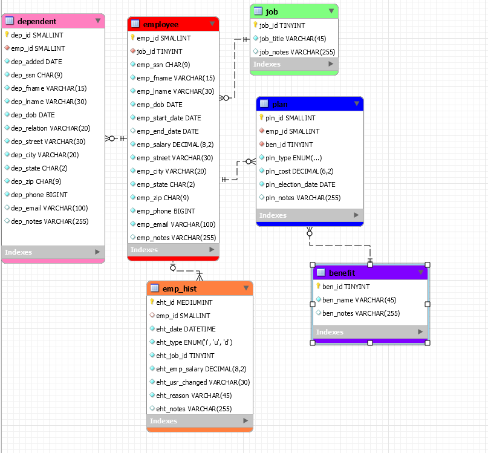
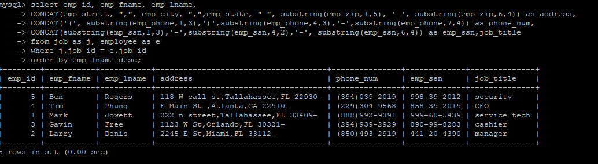

# LIS3781

## Christopher Valverde

### Assignment 1 Requirements:

*four steps:*

1. Distributed version control with Git and Bitbucket
2. AMPPS installation
3. Questions
4. Bitbucket repo links

### A1 Database Business Rules

>The human resource (HR) department of the ACME company wants to contract a database 
modeler/designer to collect the following employee data for tax purposes: job description, length of 
employment, benefits, number of dependents and their relationships, DOB of both the employee and any 
respective dependents. In addition, employees’ histories must be tracked. Also, include the following 
business rules: 

* Each employee may have one or more dependents. 
* Each employee has only one job.  
* Each job can be held by many employees.   
* Many employees may receive many benefits. 
* Many benefits may be selected by many employees (though, while they may not select any benefits—
any dependents of employees may be on an employee’s plan). 

#### README.md file should include the following items:

* Screenshot of A1 ERD
* [link to lis3781_a1_solutions file](img/lis3781_a1_solutions.sql)
* git commands with short descriptions

> #### Git commands w/short descriptions:

1. git init - Create an empty Git repository or reinitialize an existing one
2. git status - Show the working tree status
3. git add -  Add file contents to the index
4. git commit - Record changes to the repository
5. git push - Update remote refs along with associated objects
6. git pull -  Fetch from and integrate with another repository or a local branch
7. git log - show commit logs

#### Assignment Screenshots:

*Screenshot of A1 ERD*:

*Screenshot of A1 Example 1*:

#### Tutorial Links:

*Bitbucket Tutorial - Station Locations:*
[A1 Bitbucket Station Locations Tutorial Link](https://bitbucket.org/cv19d/bitbucketstationlocations/ "Bitbucket Station Locations")