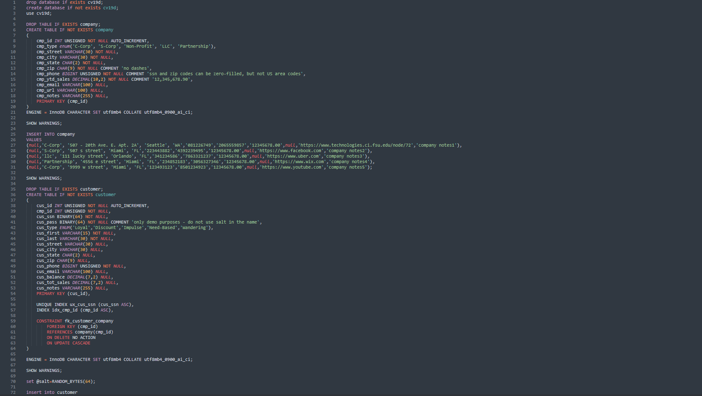
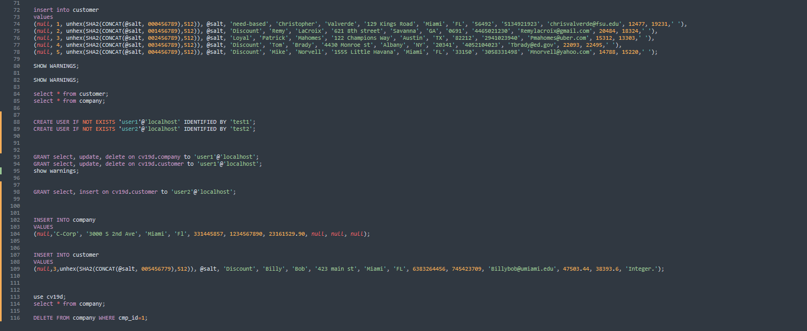
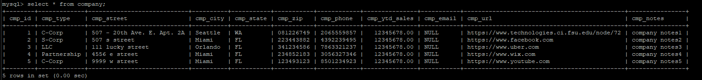
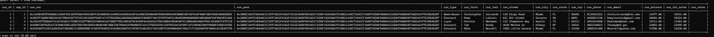

# LIS4368

## Christopher Valverde

### Assignment 2 Requirements:

*Three steps*

1. Tables and insert statements.
2. Include indexes and foreign key SQL statements
3. query result sets, including grant statements

#### README.md file should include the following items:

* Screenshot of sql code  
* Screenshot of populated tables
* [link to lis3781_a2_solutions file](img/a2solutions.sql) 

#### Assignment Screenshots:

*Screenshot of SQL code*:

*Screenshot of populated tables*:

