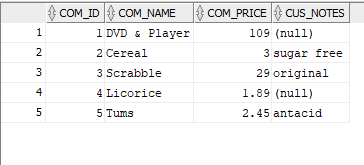

# LIS3781

## Christopher Valverde

### Assignment 3 Requirements:

*four steps*

1. log into oracle using remote labs
2. create tables using mysql
3. populate tables using mysql

#### README.md file should include the following items:

* Screenshot of SQL code used to create and populate tables
* Screenshot of populated tables (w/in the Oracle environment)
* Screenshot of one  required report and SQL code solution
* link to your [lis3781_a3_solutions.sql](img/lis3781_a3_solutions.sql "link to solutions file") file 

#### Assignment Screenshots:

*Screenshot of SQL code used to populate tables*:

*Screenshot of records in tables*:

*Screenshot of one sql report*:

