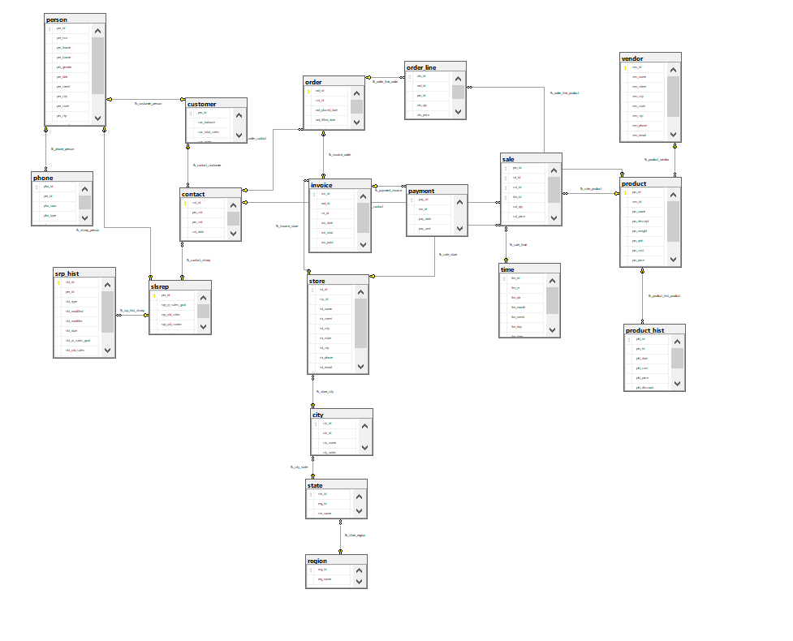
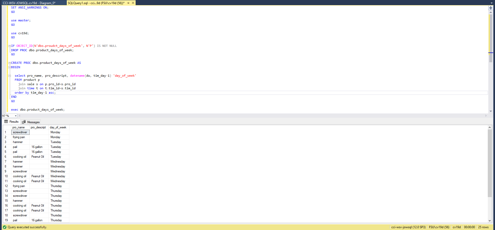

# LIS3781

## Christopher Valverde

### Assignment 5 Requirements:

*three steps*

1. ERD (tables *must* be populated using RemoteLabs – MS SQL Server)
2. SQL Statement Questions
3. Screenshot of required SQL report

#### README.md file should include the following items:

* Screenshot of ERD;
* Screenshot of At least *one* required report and SQL code solution.
* Bitbucket repo links: lis3781 Bitbucket repo link

#### Assignment Screenshots:

*Screenshot of ERD*

*Screenshot of required report*:

