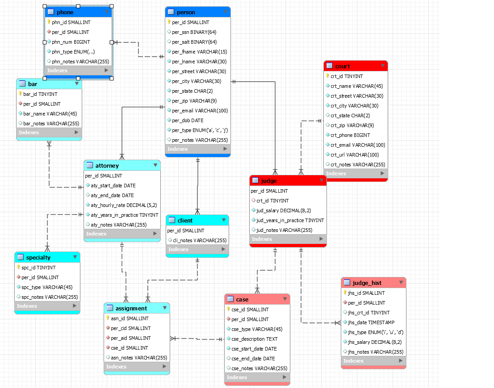

# LIS3781 - Advanced Database

## Christopher Valverde

### Project 1 Requirements:

*three steps*

1. Create erd
2. Social security numbers, should be unique, and must use SHA2 hashing with salt. 
3. ERD MUST include relationships and cardinalities.
4. bitbucket repo link

#### README.md file should include the following items:

* Screenshot of ERD
* Screenshots of one required report
* Bitbucket repo link 

> This is a blockquote.
> 
> This is the second paragraph in the blockquote.
>

#### Assignment Screenshots:

*Screenshot of Erd*:

