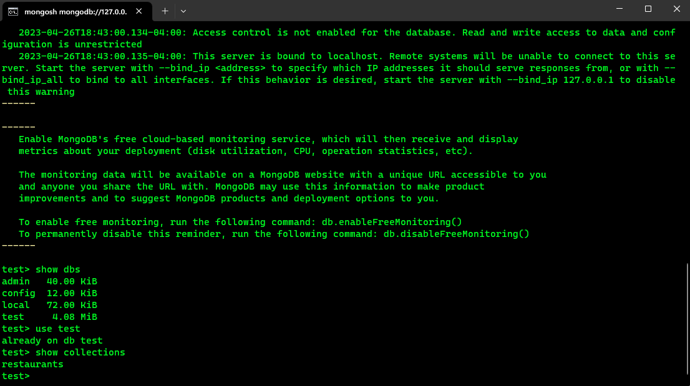
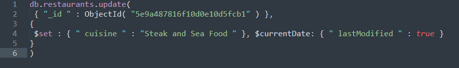
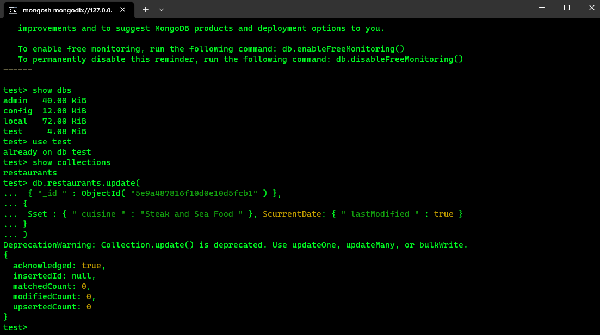

# LIS4368

## Christopher Valverde

### Project 2 Requirements:

*three steps*

1. Installation of mongoDB
2. Screenshot of one required report
3. Bitbucket repo link

#### README.md file should include the following items:

* Screenshot of at least one MongoDB shell command(s), (e.g., show collections)
* Screenshot: At least *one* required report (i.e., exercise below), and JSON code solution
* Bitbucket repo links: *Your* lis3781 Bitbucket repo link

#### Assignment Screenshots:

*Screenshot of one mongodb shell command*:

*Screenshot of sql code*:

*Screenshot of required report*:

