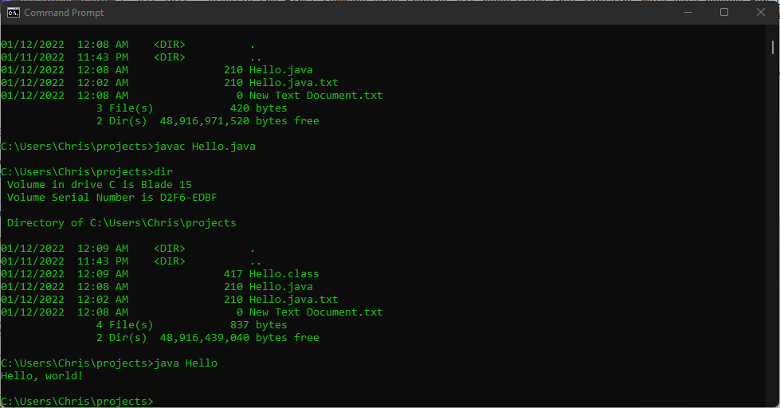
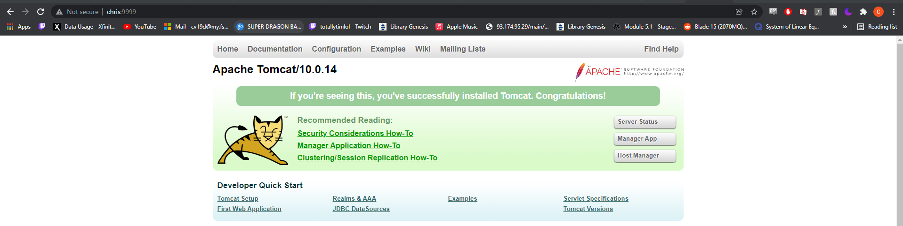
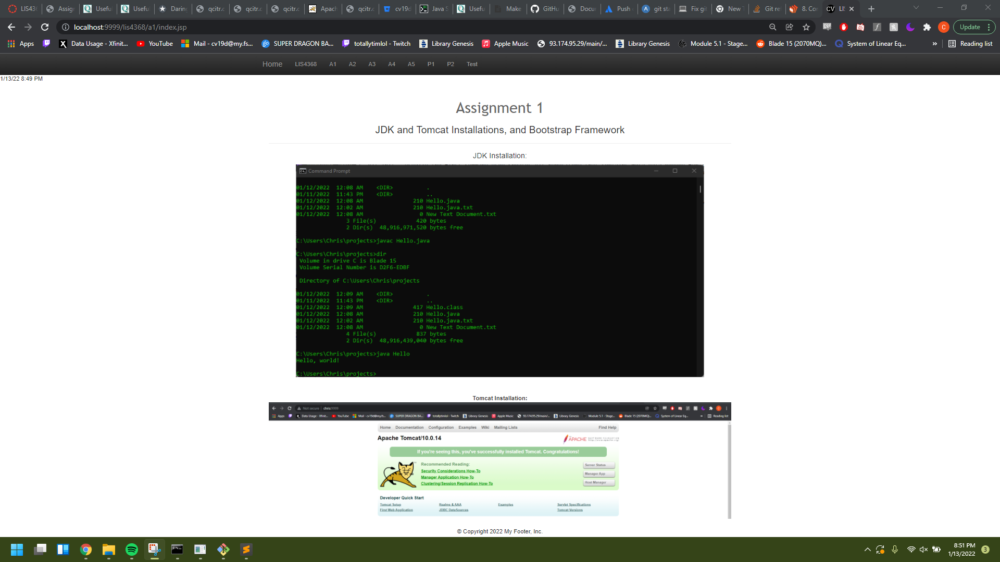

# LIS4368

## Christopher Valverde

### Assignment 1 Requirements:

*four steps:*

1. Distributed version control with Git and Bitbucket
2. Installed Ampps, JDK, Tomcat
3. Questions
4. Bitbucket repo links

#### README.md file should include the following items:

* Screenshot of running java Hello   
* Screenshot of running http://localhost:9999  
* Screenshot of a1/index.jsp 
* git commands w/short descriptions  
* Bitbucket repo links:
    * this assignment
    * bitbucketstationloacations
> This is a blockquote.
> 
> This is the second paragraph in the blockquote.
>
> #### Git commands w/short descriptions:

1. git init - Create an empty Git repository or reinitialize an existing one
2. git status - Show the working tree status
3. git add -  Add file contents to the index
4. git commit - Record changes to the repository
5. git push - Update remote refs along with associated objects
6. git pull -  Fetch from and integrate with another repository or a local branch
7. git log - show commit logs

#### Assignment Screenshots:

*Screenshot of running java Hello*:

*Screenshot of Tomcat installation*:

*Screenshot of a1/index.jsp*:

#### Tutorial Links:

*Bitbucket Tutorial - Station Locations:*
[A1 Bitbucket Station Locations Tutorial Link](https://bitbucket.org/cv19d/bitbucketstationlocations/ "Bitbucket Station Locations")