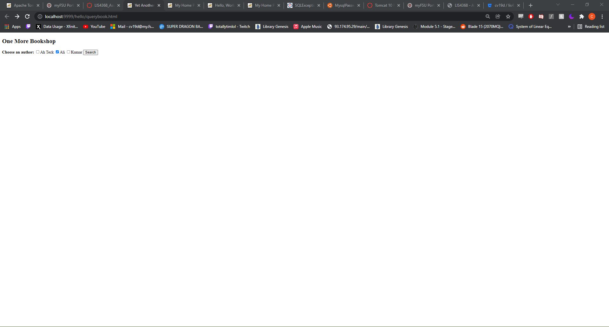
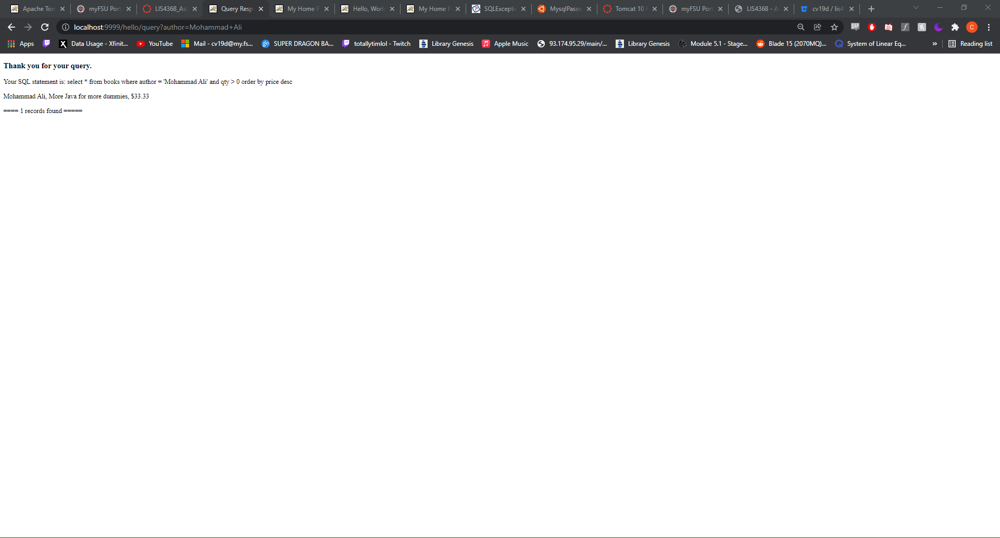
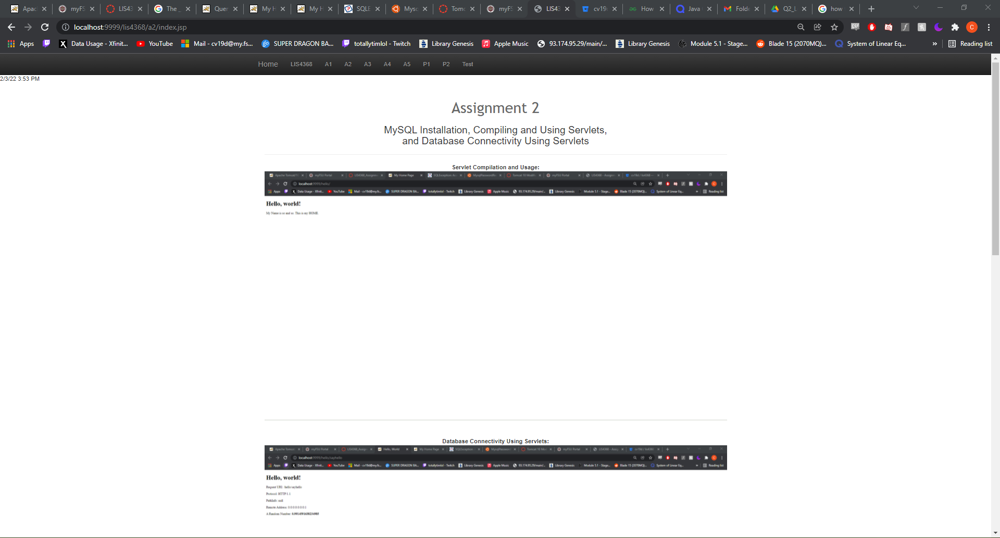
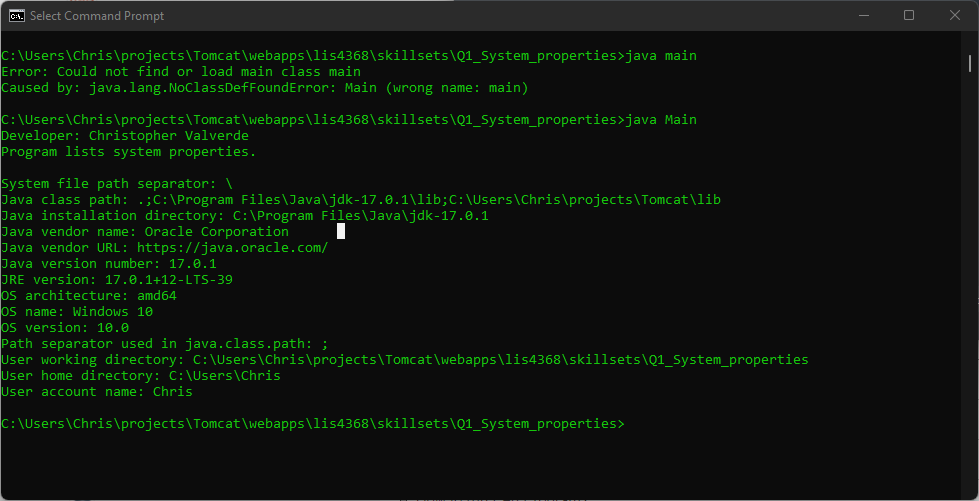
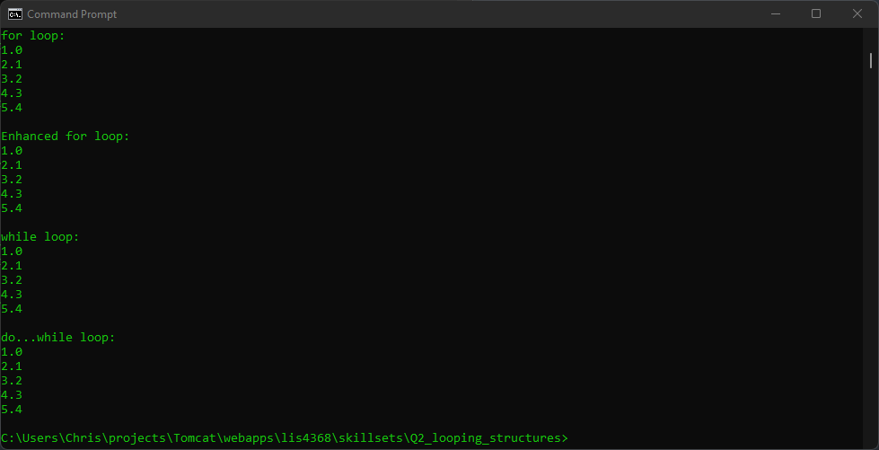
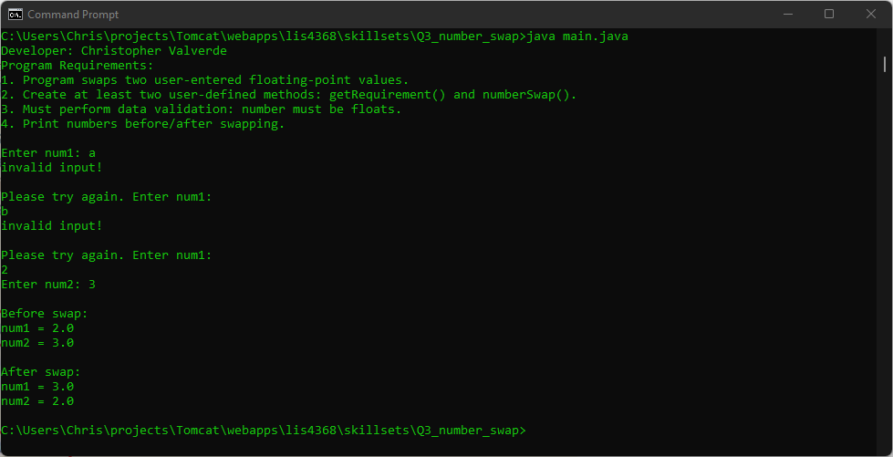

# LIS4368

## Christopher Valverde

### Assignment 2 Requirements:

*Three steps*

1. Created a database using mysql
2. Created servlets
3. Skillsets 1-3

#### README.md file should include the following items:

* Screenshot of running http://localhost:9999/hello   
* Screenshot of running http://localhost:9999/hello/HelloHome.html
* Screenshot of running http://localhost:9999/hello/querybook.html
* Screenshot of a2 index  

> This is a blockquote.
> 
> This is the second paragraph in the blockquote.
>

#### Assignment Screenshots:

*Screenshot of running Querybook servlet*:

*Screenshot of running querybook results*:

*Screenshot of a2/index.jsp*:

*Screenshot of skillset 1*:

*Screenshot of skillset 2*:

*Screenshot of skillset 3*:

