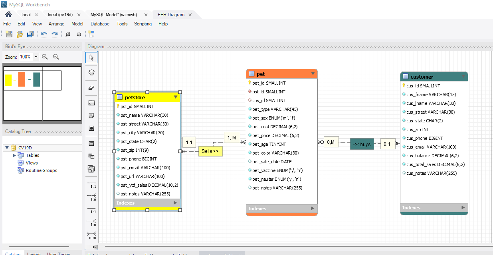
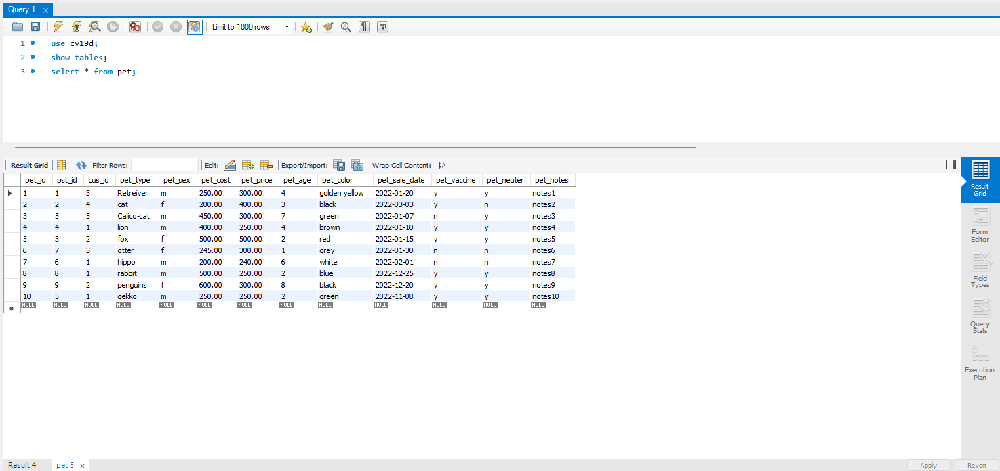
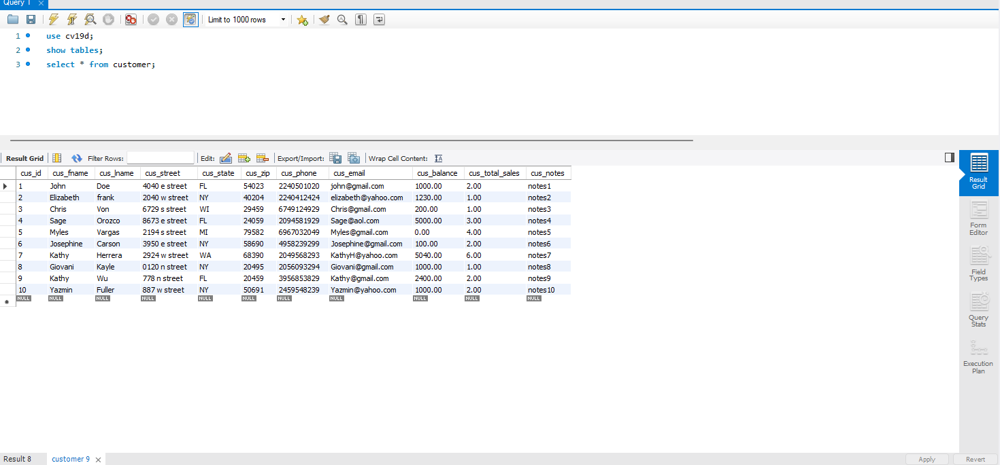
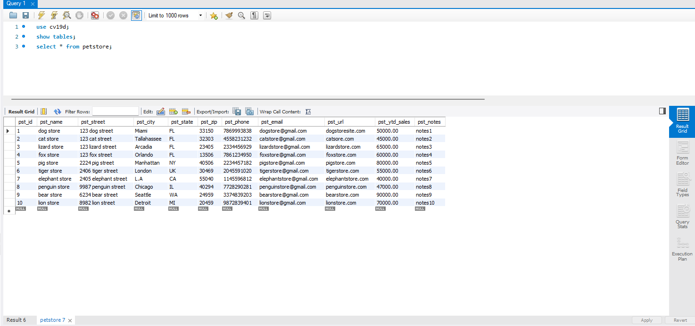
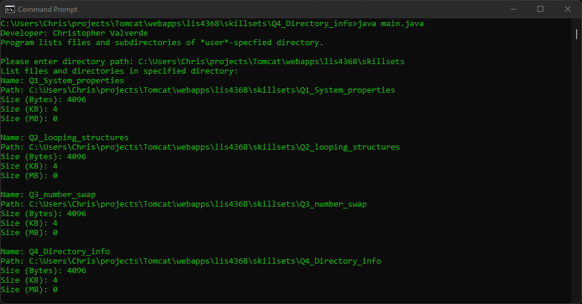
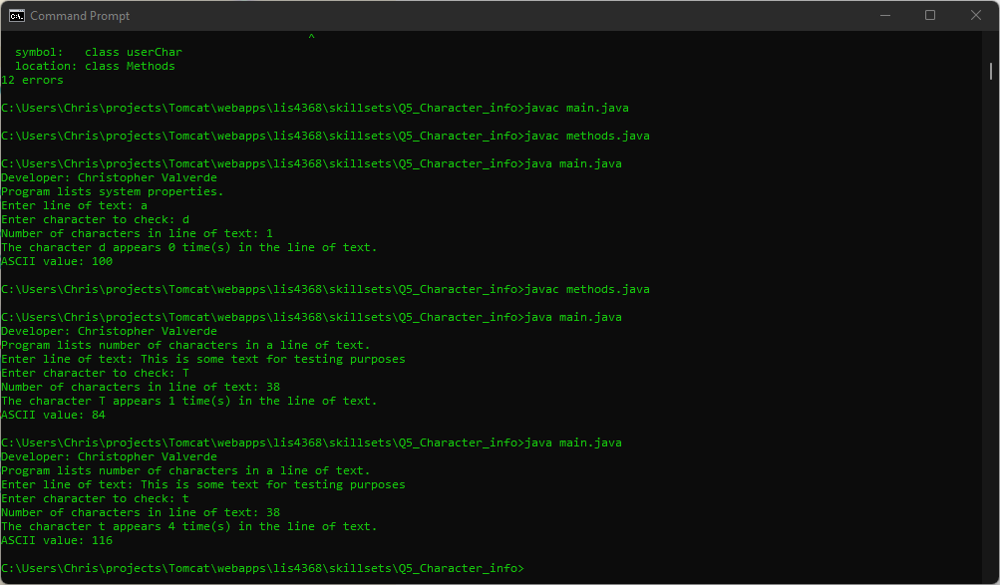
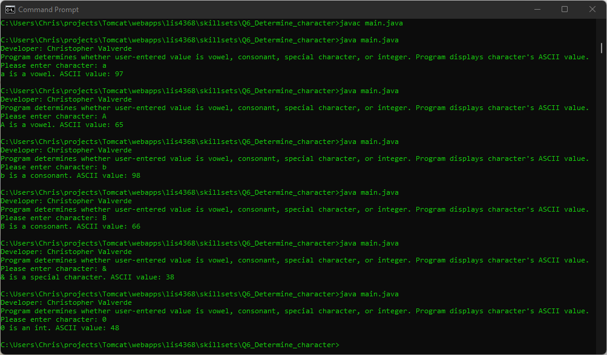

# LIS4368

## Christopher Valverde

### Assignment 3 Requirements:

*four steps*

1. Created a database using mysql
2. Created tables in mysql with correct relationships
3. Insterted data into three tables
4. Table is able to foward engineer
5. SKillset screenshots

#### README.md file should include the following items:

* Screenshot of ERD
* Screenshots of 10 records for each table—use select * from each table
* Screenshot of a3/index.jsp 
* Skillests
* Links to the following files: 
      * a3.mwb 
      * a3.sql 

> This is a blockquote.
> 
> This is the second paragraph in the blockquote.
>

#### Assignment Screenshots:

*Screenshot of ERD*:

*Screenshot of records in pet table*:

*Screenshot of customer table*:

*Screenshot of petstore table*:

*Screenshot of skillset 4*:

*Screenshot of skillset 5*:

*Screenshot of skillset 6*:

*A3 docs: a3.mwb and a3.sql*: 
 
[A3 MWB File](docs/a3.mwb "A3 ERD in .mwb format") 
 
[A3 SQL File](docs/a3.sql "A3 SQL Script") 
