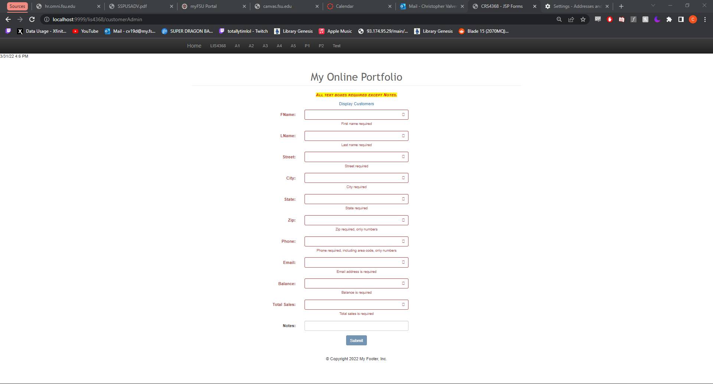
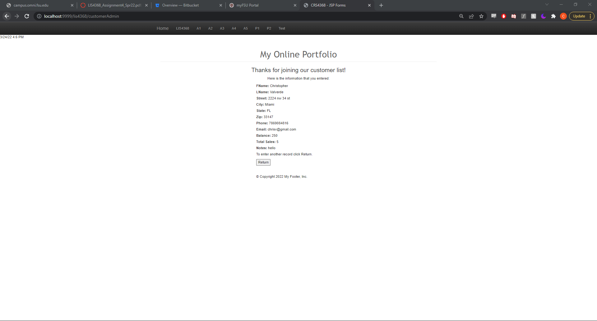
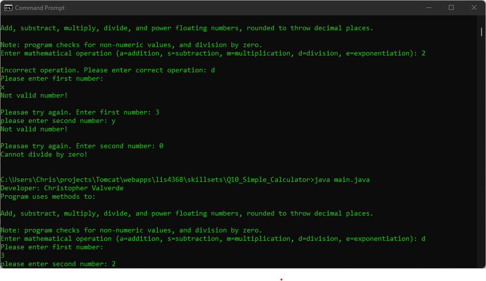
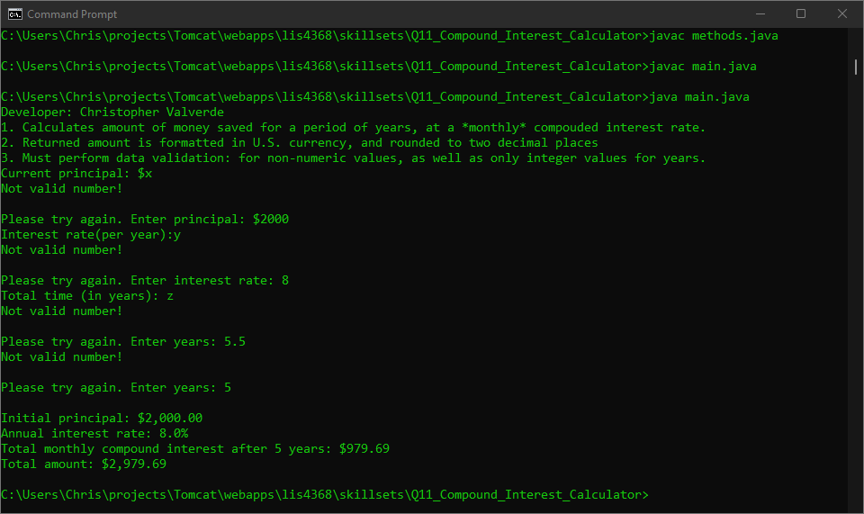
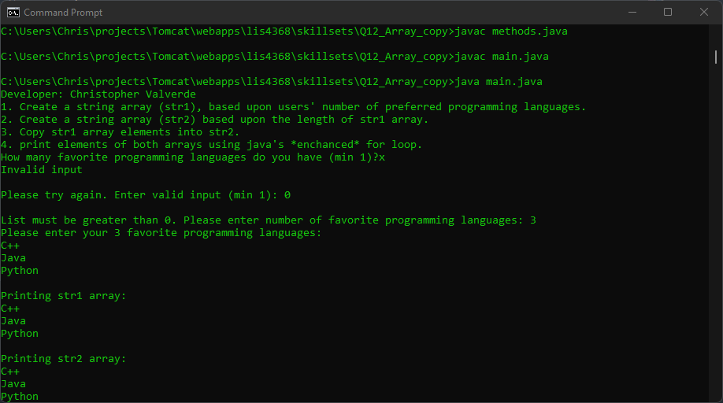

# LIS4368

## Christopher Valverde

### Assignment 4 Requirements:

*four steps*

1. Review directories
2. added server-side validation with servlets
3. Sucessfully compiled all servlets
4. Skillsets

#### README.md file should include the following items:

* Screenshot of passed validation
* Screenshot of faileed validation 
* Skillests

> This is a blockquote.
> 
> This is the second paragraph in the blockquote.
>

#### Assignment Screenshots:

*Screenshot of failed validation*

*Screenshot of passed validation*:

*Screenshot of skillset 10*:

*Screenshot of skillset 11*:

*Screenshot of skillset 12*:

