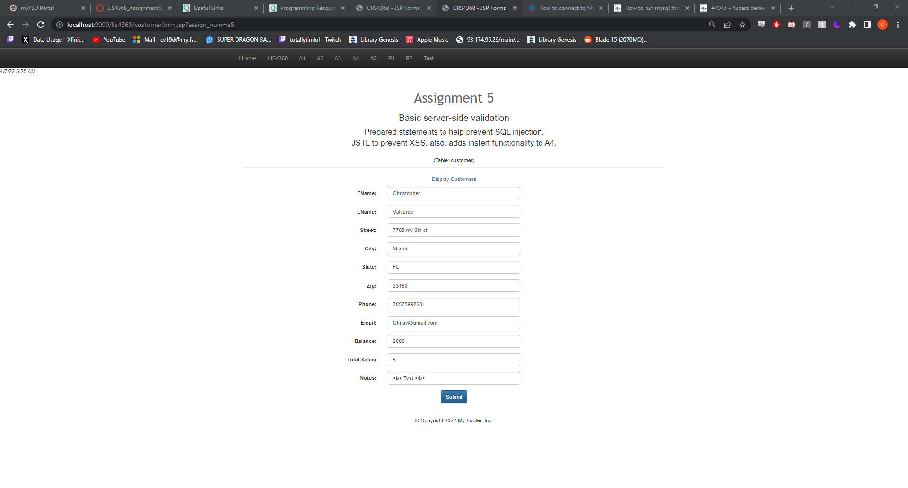
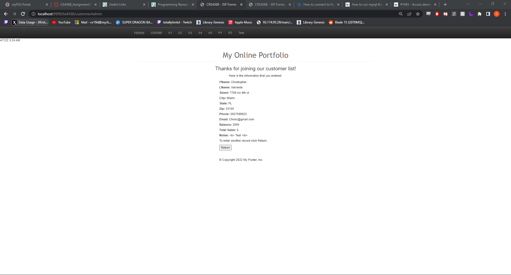
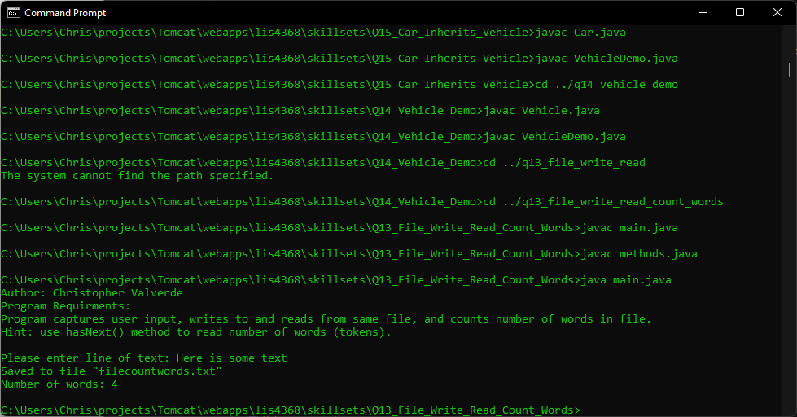
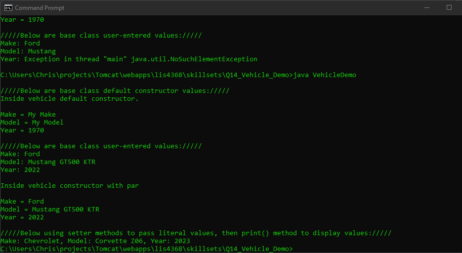
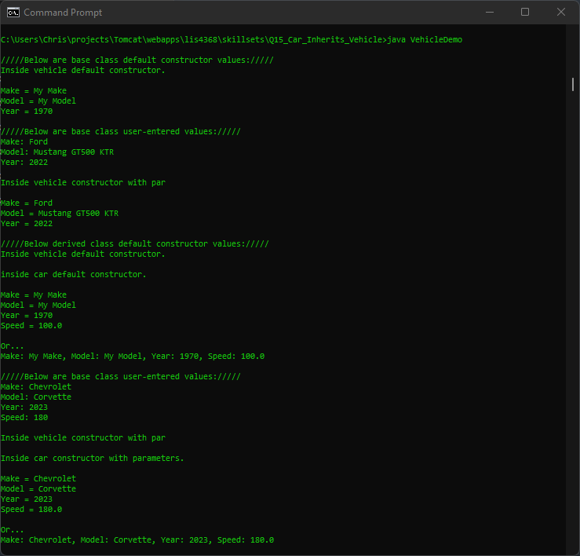

# LIS4368

## Christopher Valverde

### Assignment 5 Requirements:

*four steps*

1. Included server-side validation from A4
2. Created/compiled servlets in crud/data directory
3. Updated database entry
4. Skillsets

#### README.md file should include the following items:

* Screenshot of Valid user form entry
* Screenshot of Passed validation 
* Associated Database Entry
* Skillests

> This is a blockquote.
> 
> This is the second paragraph in the blockquote.
>

#### Assignment Screenshots:

*Screenshot of Valid user form entry*

*Screenshot of passed validation*:

*Screenshot of skillset 13*:

*Screenshot of skillset 14*:

*Screenshot of skillset 15*:

