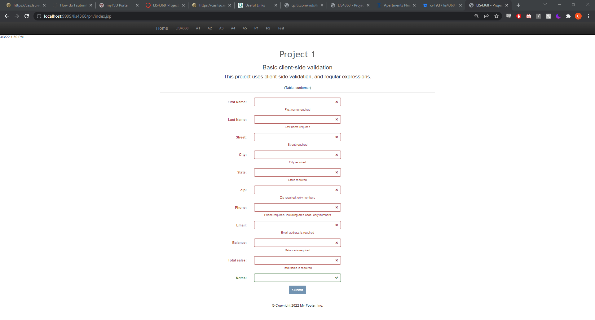
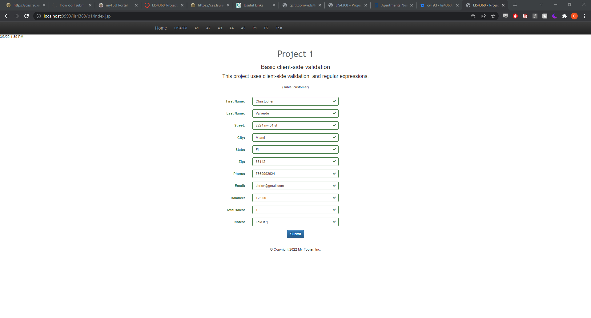
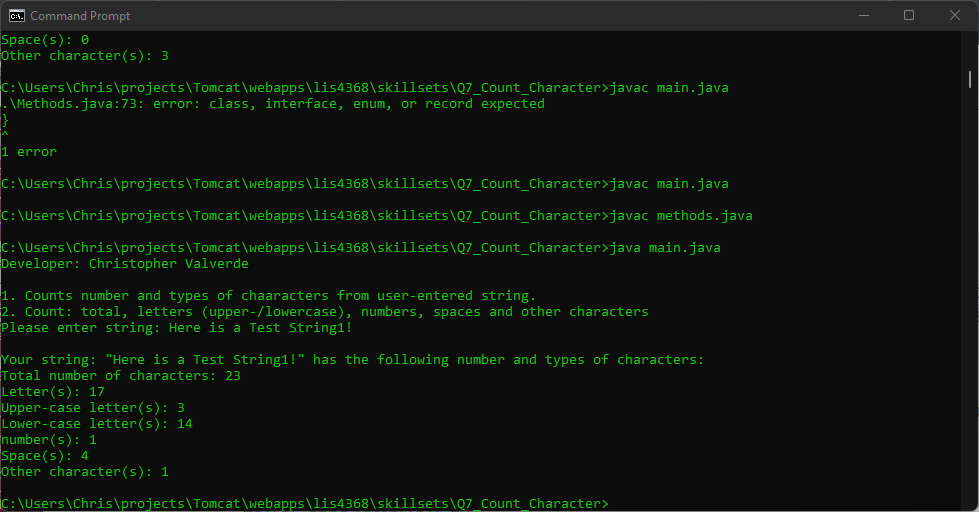
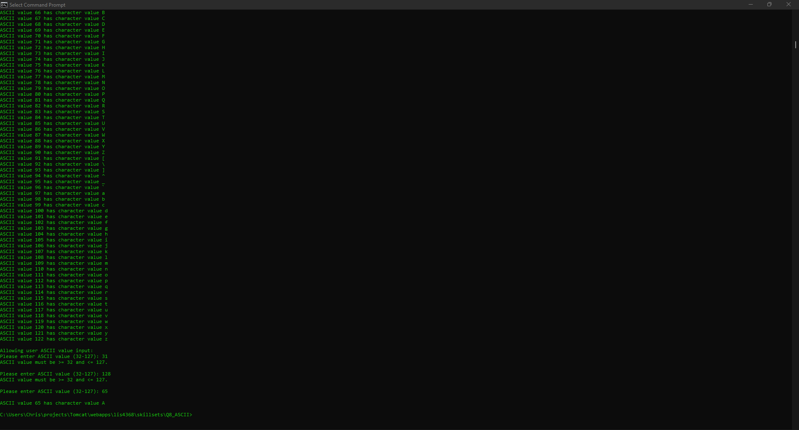
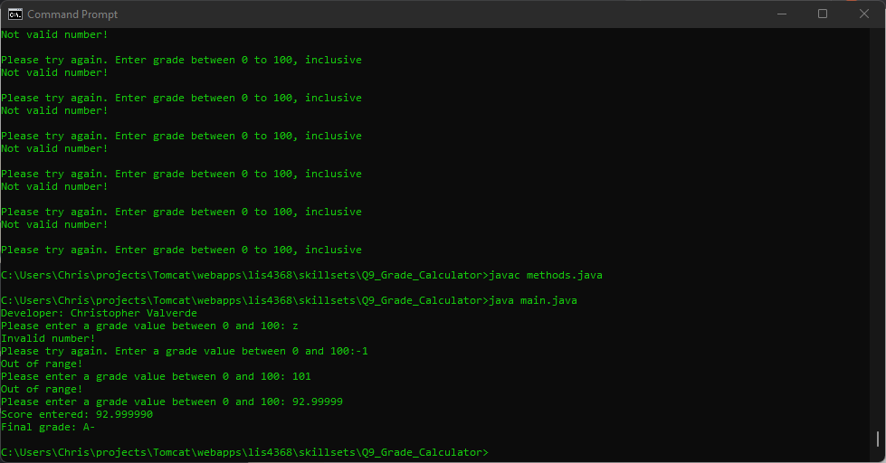

# LIS4368

## Christopher Valverde

### Project 1 Requirements:

*four steps*

1. Creted form controls to match attributes of customer entitiy
2. Used min/max JQUERY validation
3. Used regexp to allow apporpriate characters for each control
4. SKillset screenshots

#### README.md file should include the following items:

* Screenshot of failed validation
* Screenshots of passed validation
* Skillests

> This is a blockquote.
> 
> This is the second paragraph in the blockquote.
>

#### Assignment Screenshots:

*Screenshot of failed validation*:

*Screenshot of passed validation*:

*Screenshot of skillset 7*:

*Screenshot of skillset 8*:

*Screenshot of skillset 9*:

