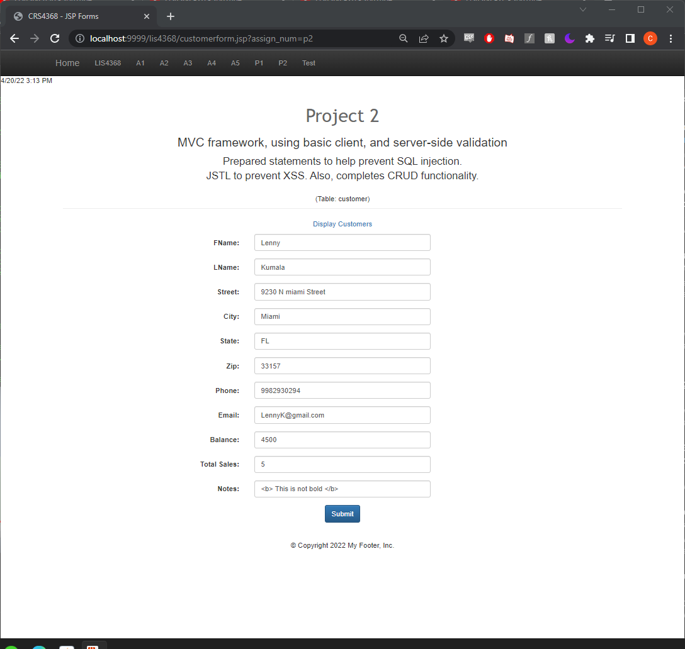
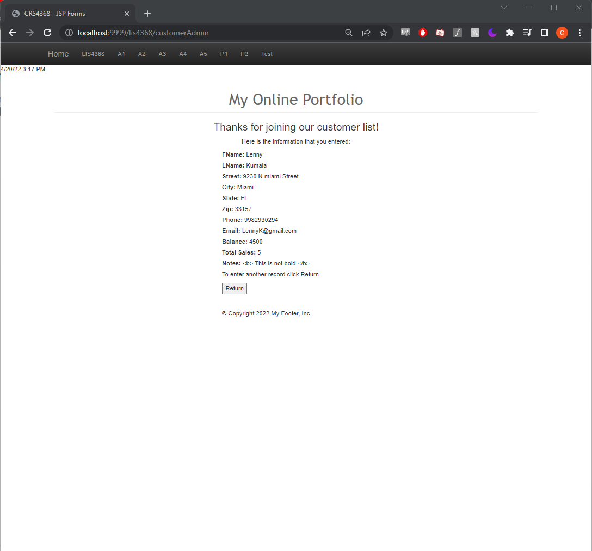
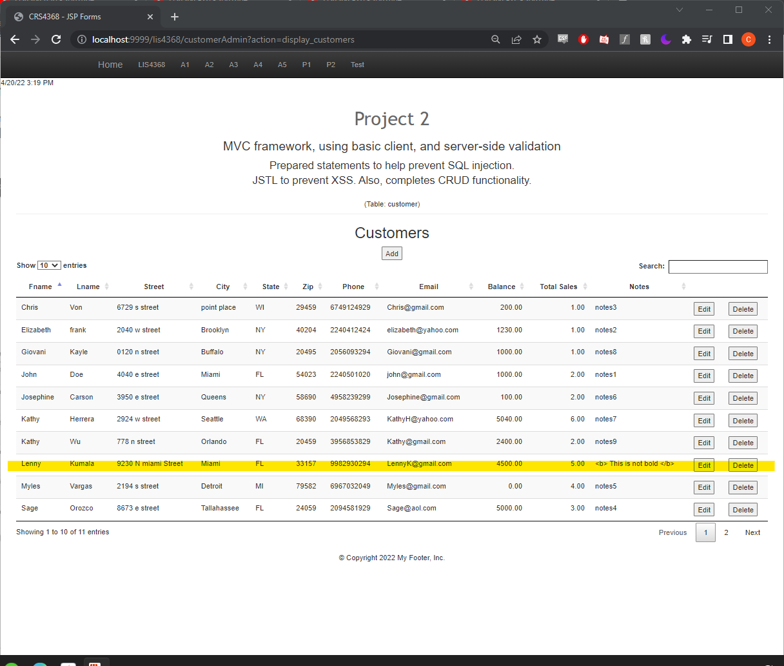
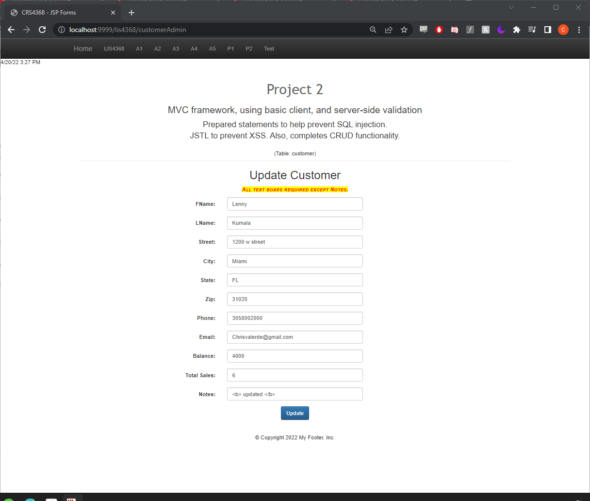
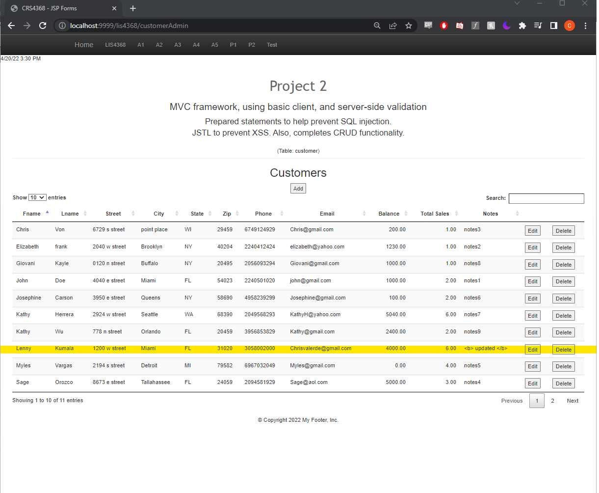
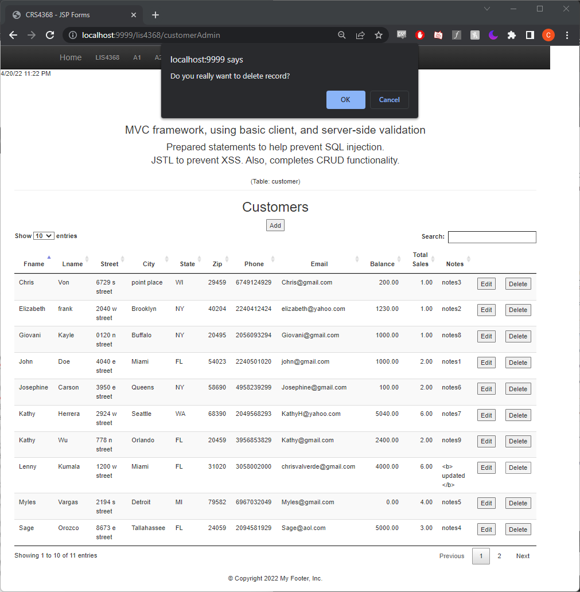
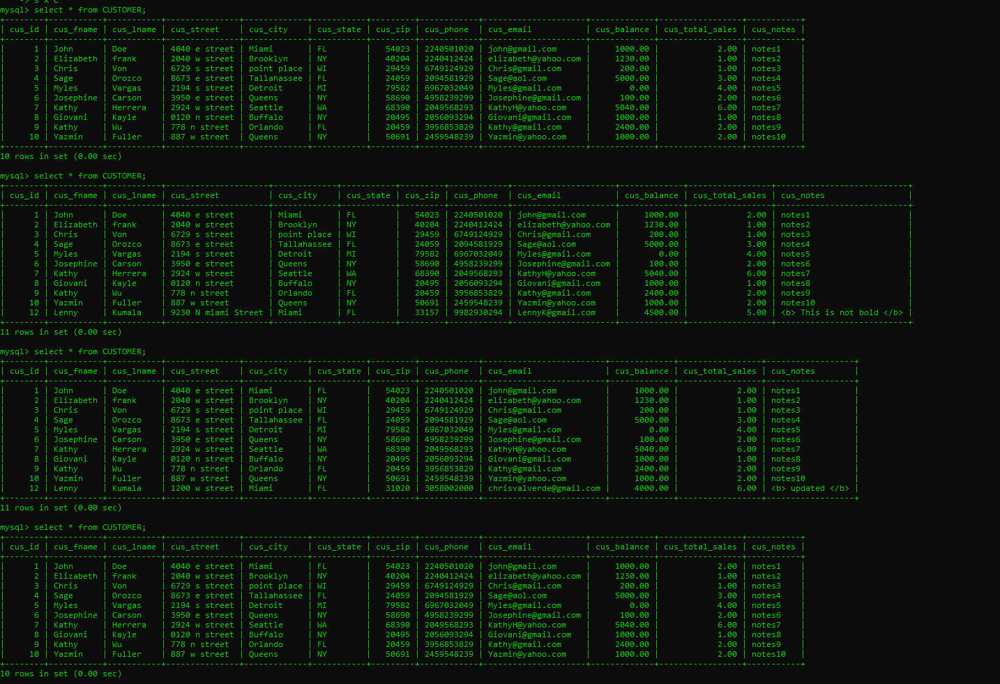

# LIS4368

## Christopher Valverde

### Project 2 Requirements:

*three steps*

1. Included server-side validation from A4
2. Created/compiled servlets in crud/data directory
3. Added create, read, update, delete (CRUD) Functionality

#### README.md file should include the following items:

* Screenshot of Valid user form entry
* Screenshot of Passed validation 
* Screenshot of displaying data from customer.jsp
* Screenshot of modify form
* Screenshot of modified data
* Screenshot of delete warning
* Associated database changes (Select, Insert, Update, Delete)

#### Assignment Screenshots:

<table>
  <tr>
    <td>Valid user form entry</td>
     <td>passed validation</td>
  </tr>
  <tr>
    <td></td>
    <td></td>
  </tr>
 </table>

*Screenshot of Display Data*:

<table>
  <tr>
    <td>modify form</td>
     <td>modified data</td>
  </tr>
  <tr>
    <td></td>
    <td></td>
  </tr>
 </table>

*Screenshot of delete warning*:

*Screenshot of associated database changes*:

