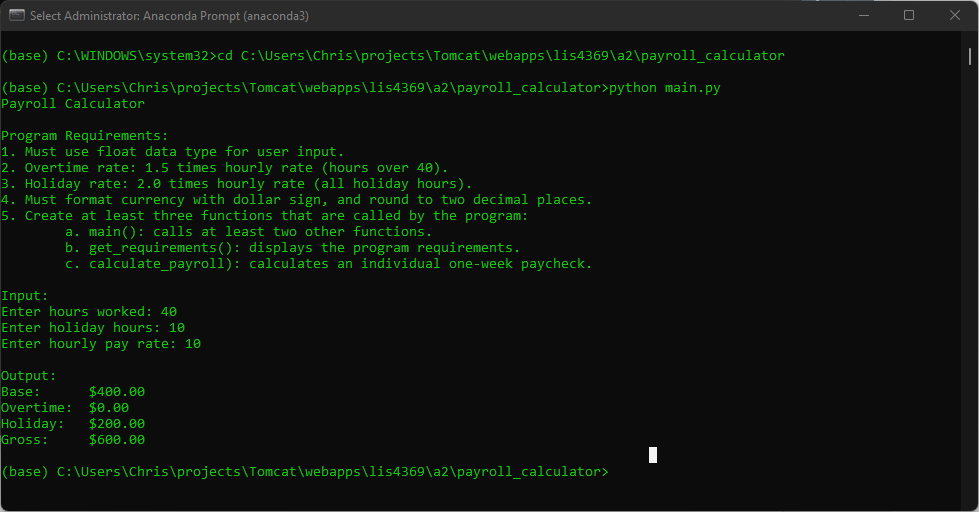

> **NOTE:** This README.md file should be placed at the **root of each of your repos directories.**
1. Bitbucket link
2. Assignment screenshots
3. Skillsets 1-3
4. Questions

#### README.md file should include the following items:

* screenshot of a1_payroll running
* Link to A2 .ipynb file: [a2_payroll.ipynb](payroll_calculator/a2_payroll.ipynb "A2 Jupyter Notebook")
* screenshots of reverse engineered code. 
* Skillsets

#### Assignment Screenshots:

*Screenshot of a2_payroll application running(IDLE)*:

*Screenshot of a2_payroll application running(IDLE)*:

*Screenshot of skillset 1*:

*Screenshot of skillset 2*:

*Screenshot of skillset 3*:

*A2 Jupyter Notebook*:

