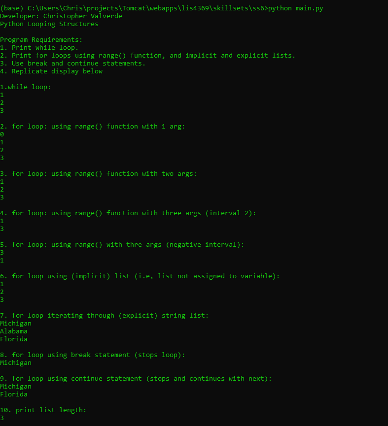
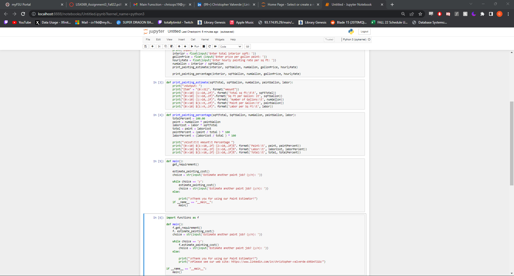

# LIS4369 - Extensible Enterprise Solutions

## Christopher Valverde

### Assignment 3 Requirements:
> **NOTE:** This README.md file should be placed at the **root of each of your repos directories.**
1. Assignment requirements, as per A1. 
2. Include Jupyter Notebook screenshots. 
3. Upload A3 .ipynb file and create link in README.md; 
    a. Restart & Clear Output 
    b. Restart & Run All 

#### README.md file should include the following items:

* screenshot of a3_painting_estimator running
* Link to A3 .ipynb file: [a3_painting_estimator.ipynb](painting_estimator/paintingestimator.ipynb "A3 Jupyter Notebook")
* screenshots of reverse engineered code. 
* Skillsets

#### Assignment Screenshots:

*Screenshot of a3_painting_estimate application running(IDLE)*:

*Screenshot of skillset 4*:

*Screenshot of skillset 5*:

*Screenshot of skillset 6*:

*A3 Jupyter Notebook*:

