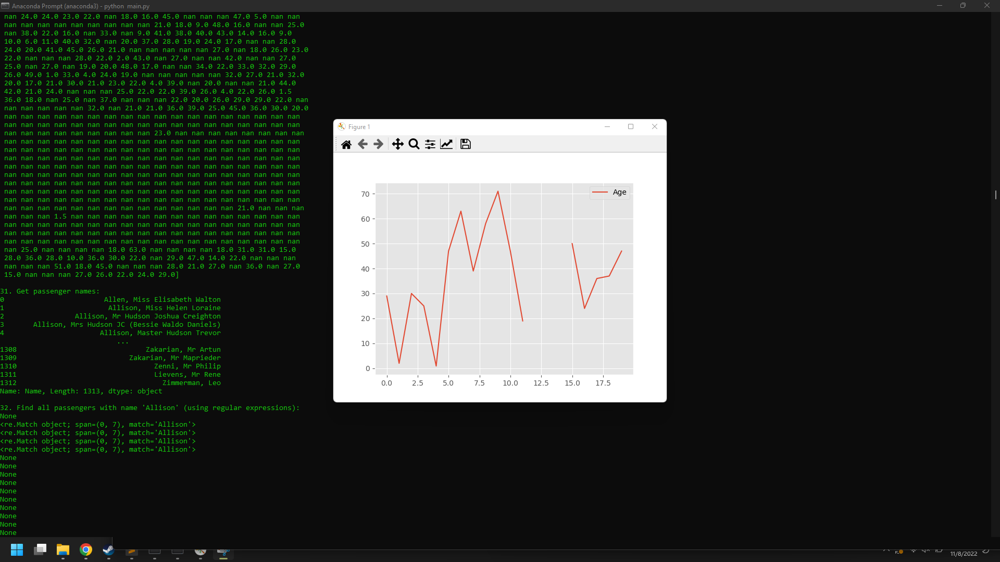
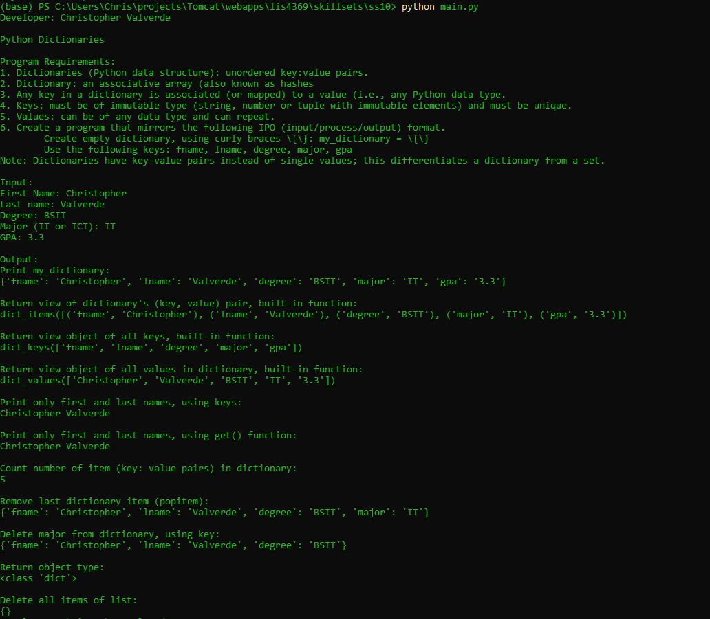
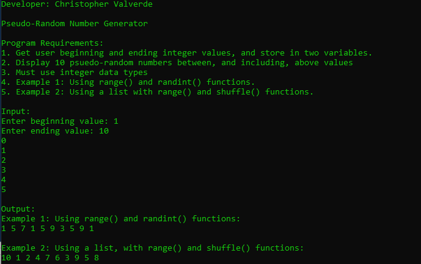
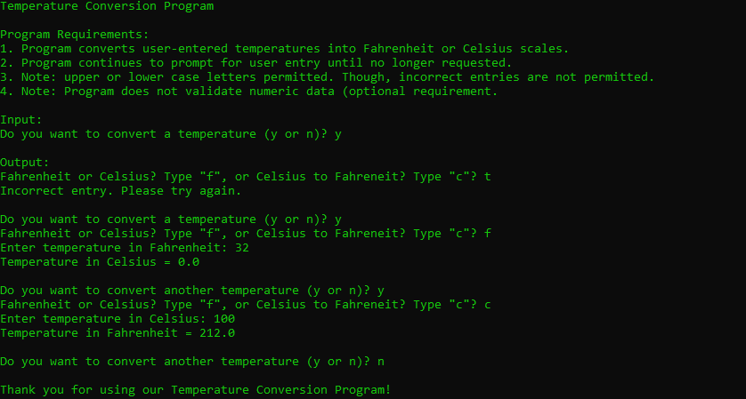
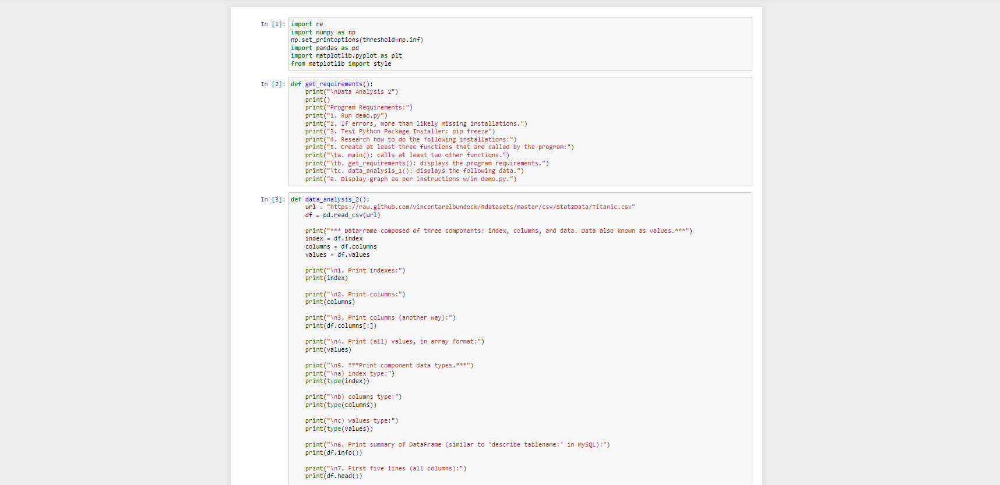
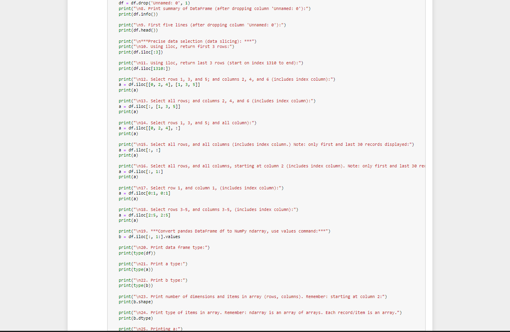
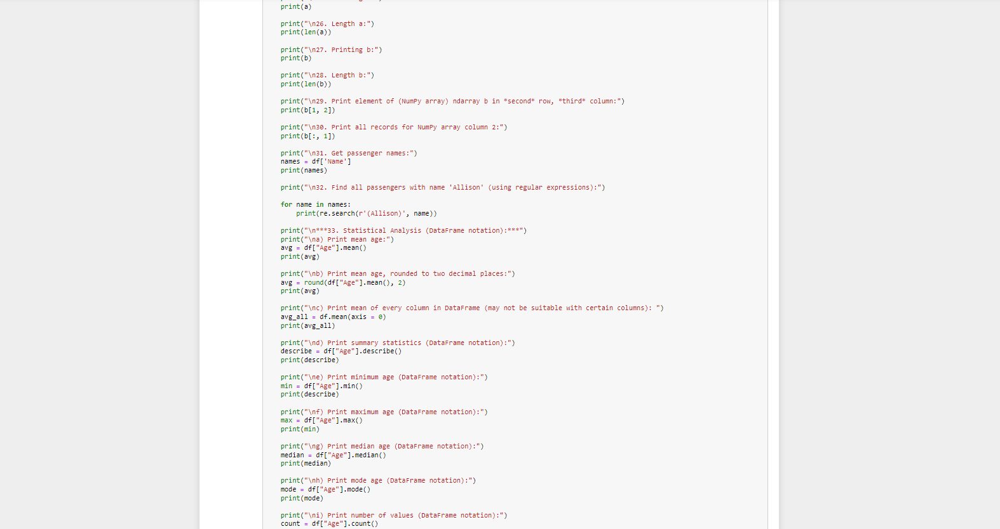
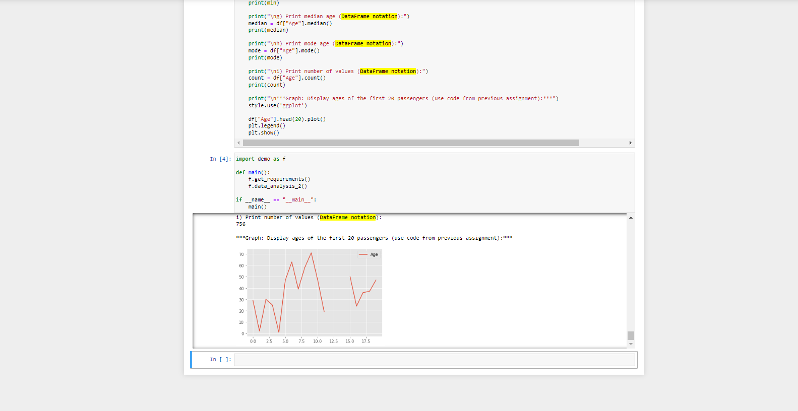

# LIS4369 - Extensible Enterprise Solutions

## Christopher Valverde

### Assignment 4 Requirements:
> **NOTE:** This README.md file should be placed at the **root of each of your repos directories.**
1. Assignment requirements, as per A1. 
2. Include Jupyter Notebook screenshots. 
3. Upload A4 .ipynb file and create link in README.md; 
    * a. Restart & Clear Output 
    * b. Restart & Run All 

#### README.md file should include the following items:

* screenshot of a3_painting_estimator running
* Link to A4 .ipynb file: [a4_data_analysis.ipynb](data_analysis/a4jp.ipynb "A4 Jupyter Notebook")
* screenshots of reverse engineered code. 
* Skillsets

#### Assignment Screenshots:

*Screenshot of a4_data_analysis application running(IDLE)*:

*Screenshot of skillset 10*:

*Screenshot of skillset 11*:

*Screenshot of skillset 12*:

*A4 Jupyter Notebook*:

