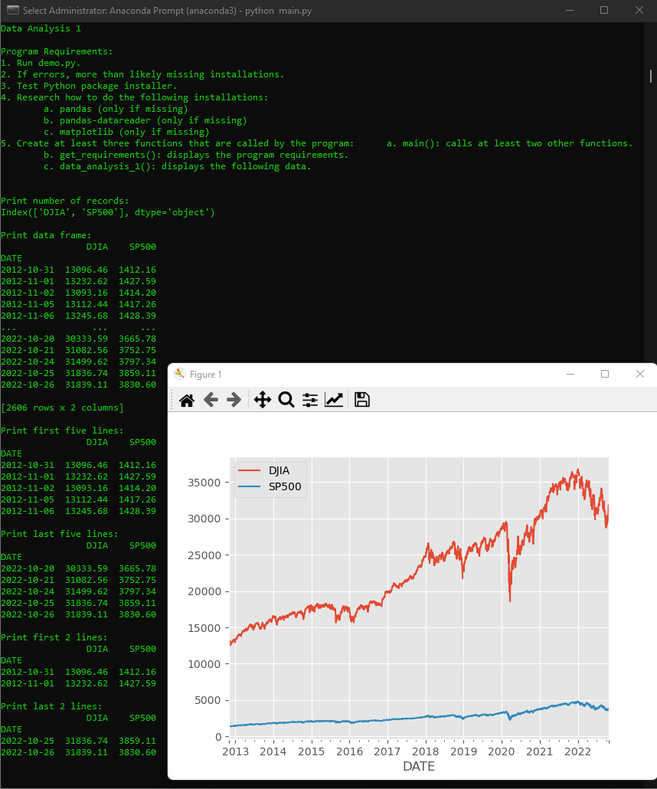
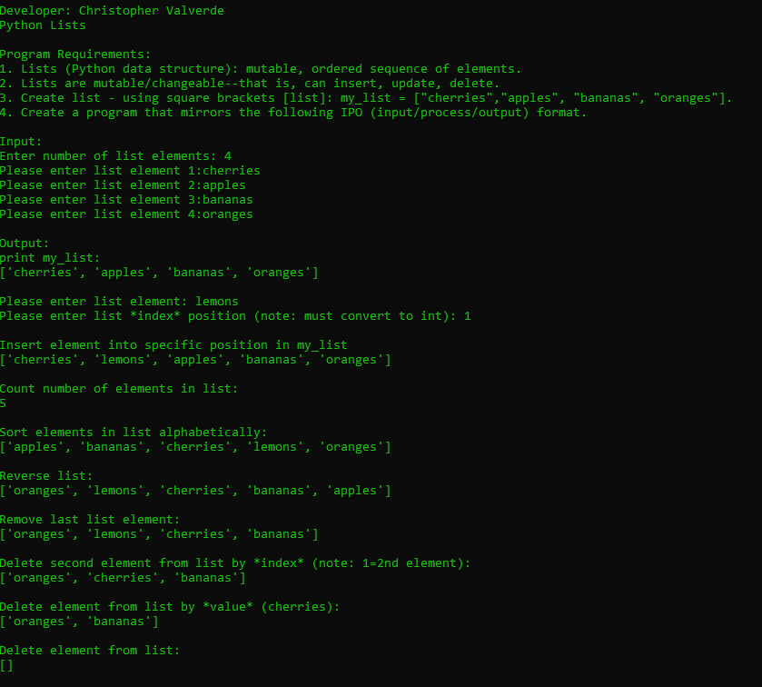
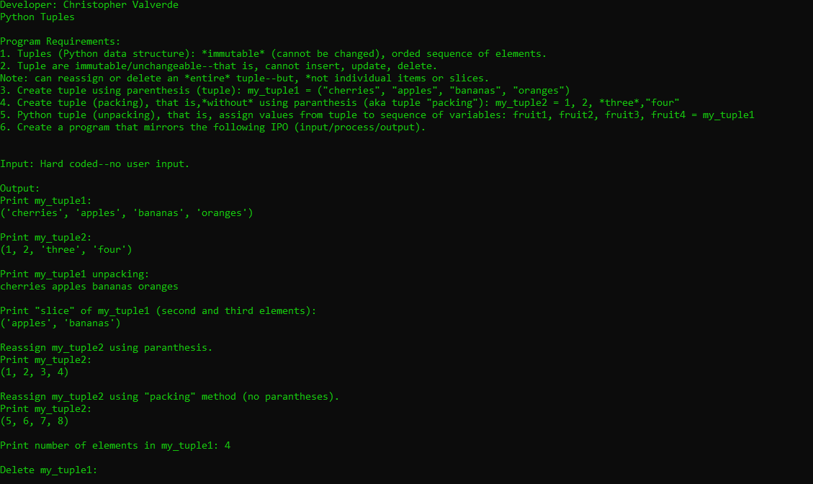
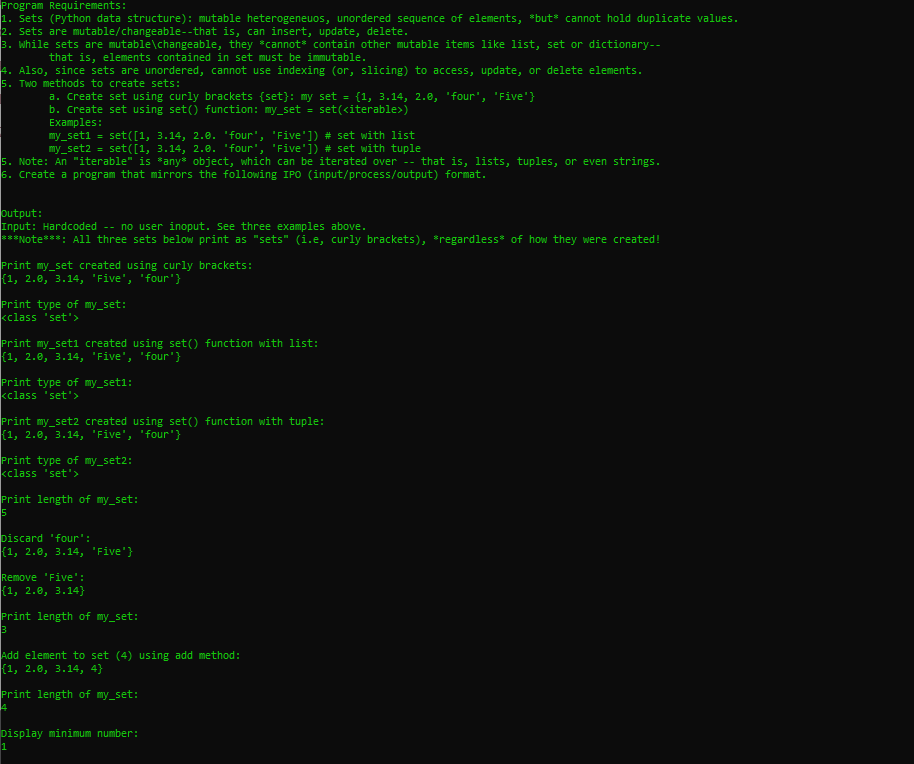
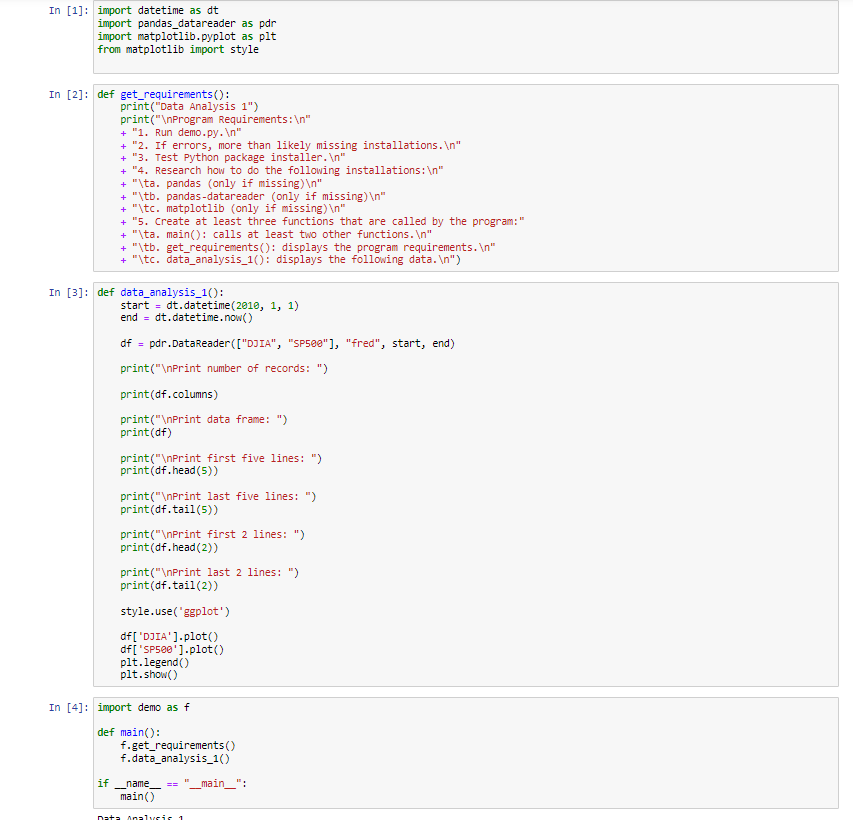
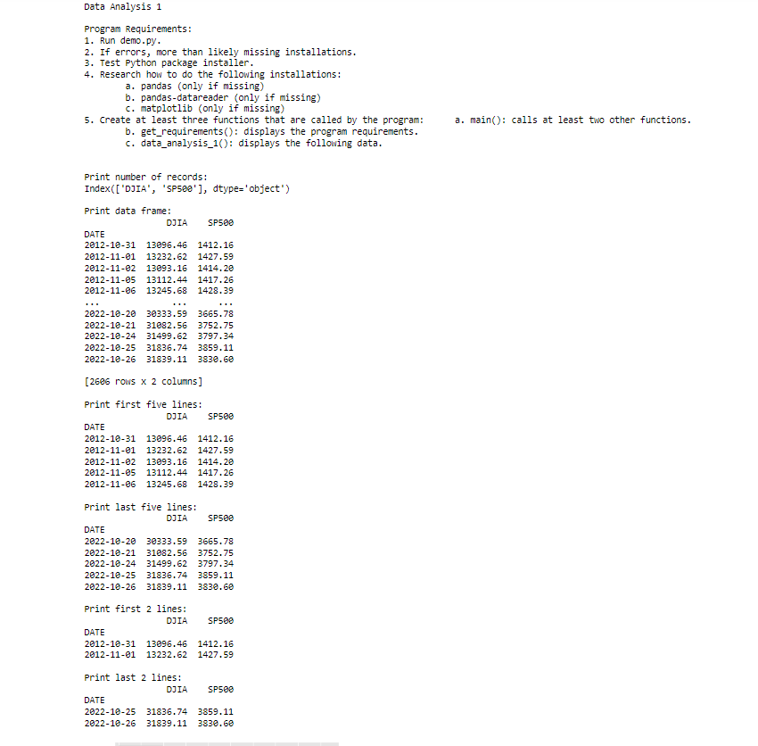
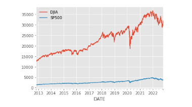

# LIS4369 - Extensible Enterprise Solutions

## Christopher Valverde

### Project 1 Requirements:
> **NOTE:** This README.md file should be placed at the **root of each of your repos directories.**
1. Backward engineer screenshots 
2. Include Jupyter Notebook screenshots. 
3. Upload p1 .ipynb file and create link in README.md; 
    a. Restart & Clear Output 
    b. Restart & Run All 

#### README.md file should include the following items:

* screenshot of p1 running
* Link to P1 .ipynb file: [p1.ipynb](project1.ipynb "p1 Jupyter Notebook")
* screenshots of reverse engineered code. 
* Skillsets

#### Assignment Screenshots:

*Screenshot of p1 running(IDLE)*:

*Screenshot of skillset 7*:

*Screenshot of skillset 8*:

*Screenshot of skillset 9*:

*P1 Jupyter Notebook*:

