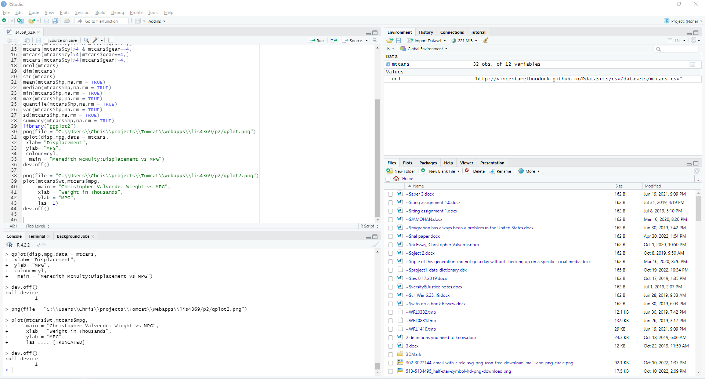
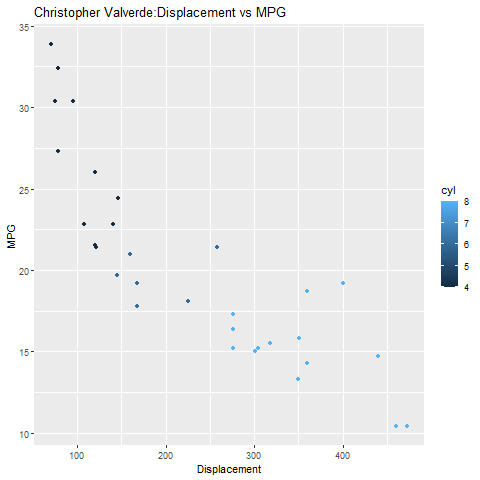
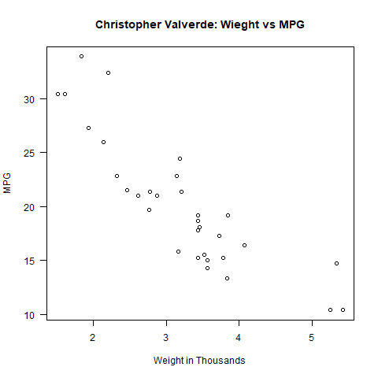

# LIS4369 - Extensible Enterprise Solutions

## Christopher Valverde

### Project 2 Requirements:
> **NOTE:** This README.md file should be placed at the **root of each of your repos directories.**
1. Save as lis4369_p2.R. Include link to file inn p2 README.md fill  
2. Include link to lis4369_p2_output.txt file  
3. Include at least one 4-panel RStudio screenshot executing lis4369_p2.R code
4. Also, be sure to include at least two plots (*must* include *your* name in plot titles), in 
your README.md file. See examples below.

#### README.md file should include the following items:

* screenshot of project 2 running
* Link to Rstudio file: [Lis4369_p2.R](https://bitbucket.org/cv19d/lis4369/src/master/p2/lis4369_p2.R "R Studio File")
* Link to Rstudio text file: [requirements text file](https://bitbucket.org/cv19d/lis4369/src/master/p2/lis4369_p2_requirements_output.txt "R Studio text file")
* screenshots of two plots. 

#### Assignment Screenshots:

*Screenshot of R Studio 4 panel screenshot*:

*Screenshot of qplot1*:

*Screenshot of qplot2*:

