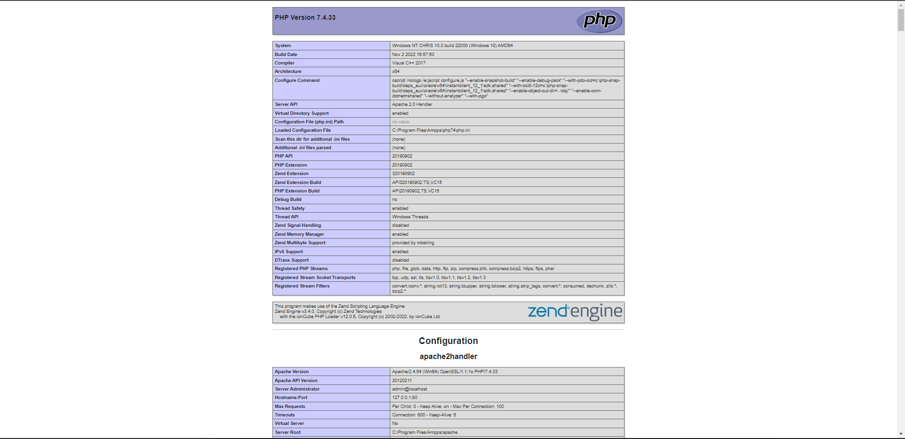
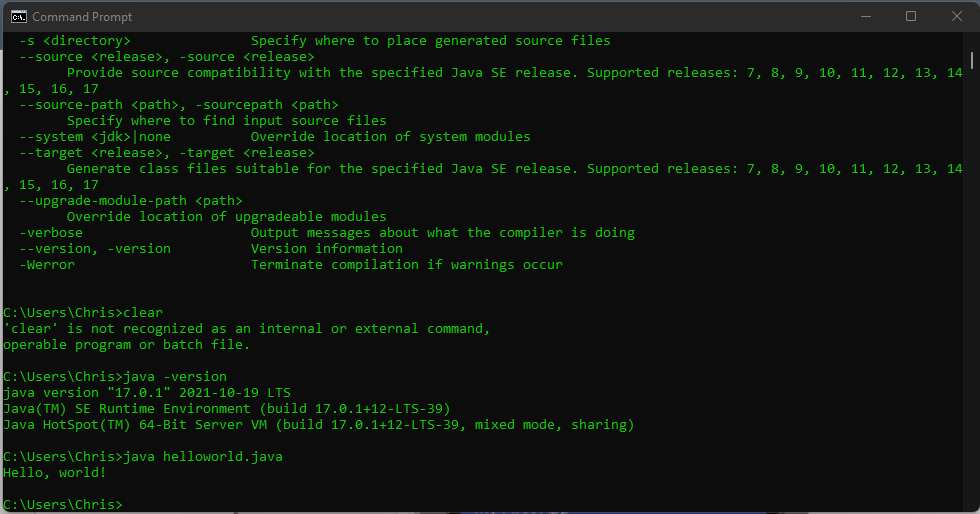
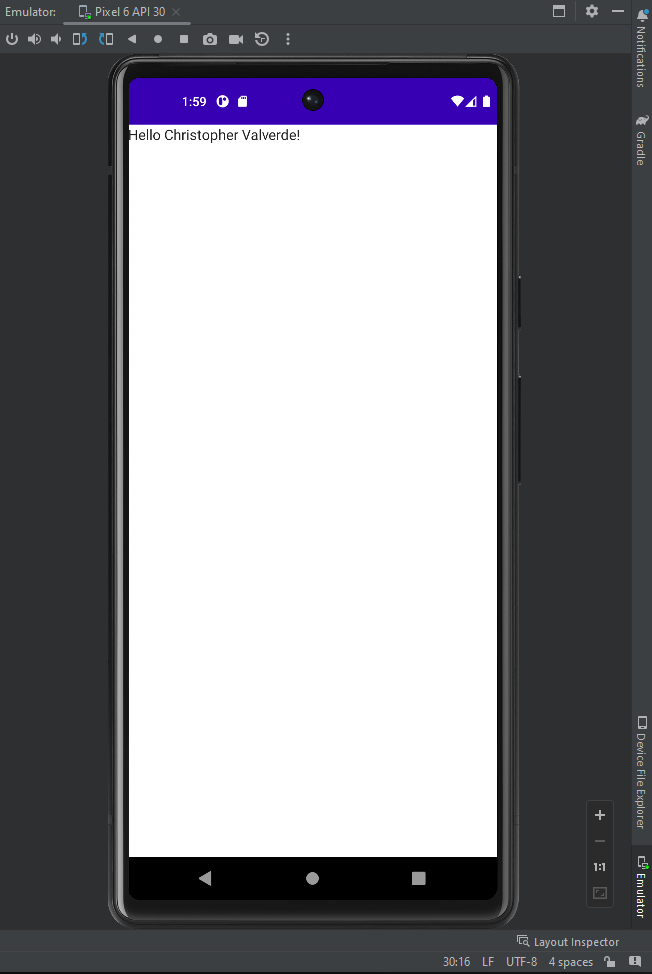

> **NOTE:** This README.md file should be placed at the **root of each of your repos directories.**
>
>Also, this file **must** use Markdown syntax, and provide project documentation as per below--otherwise, points **will** be deducted.
>

# LIS4381 -  Mobile web applications

## Christopher Valverde

### Assignment 1 Requirements:

*four parts:*

1. Distributed Version Control with Git Bitbucket
2. Development Installations
3. Questions

#### README.md file should include the following items:

* screenshot of AMPPS installation [My PHP installation](img/php.png) 
* screenshot of running java hello
* screnshot of running android studio - My first app
* git commands with short descriptions
* Bitbucket repo links

> #### Git commands w/short descriptions:

1. git init - Create an empty Git repository or reinitialize an existing one
2. git status - Show the working tree status
3. git add -  Add file contents to the index
4. git commit - Record changes to the repository
5. git push - Update remote refs along with associated objects
6. git pull -  Fetch from and integrate with another repository or a local branch
7. git log - show commit logs

#### Assignment Screenshots:

*Screenshot of AMPPS running [My PHP installation](img/php.png)*:

*Screenshot of running java Hello*:

*Screenshot of Android Studio - My First App*:

#### Tutorial Links:

*Bitbucket Tutorial - Station Locations:*
[A1 Bitbucket Station Locations Tutorial Link](https://bitbucket.org/cv19d/bitbucketstationlocations/src/master/ "Bitbucket Station Locations")
