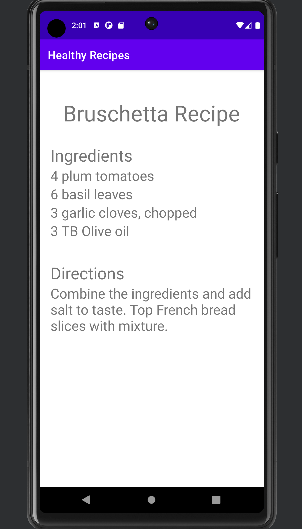
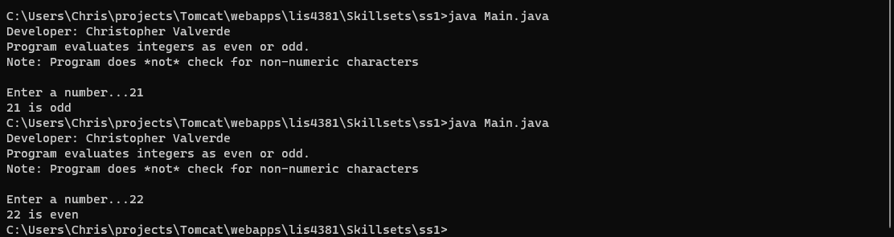
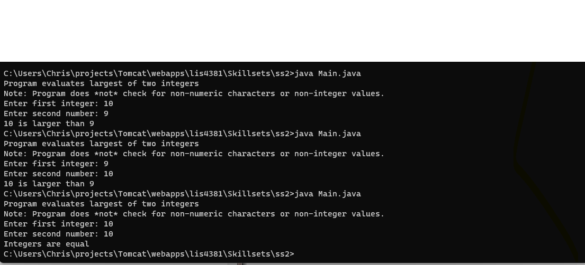
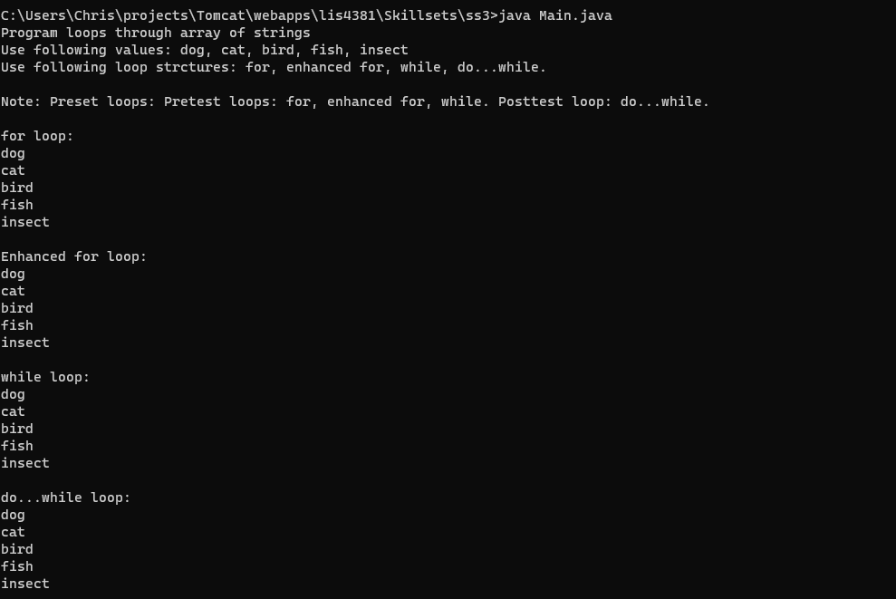

> **NOTE:** This README.md file should be placed at the **root of each of your repos directories.**
>
>Also, this file **must** use Markdown syntax, and provide project documentation as per below--otherwise, points **will** be deducted.
>

# LIS4381 -  Mobile web applications

## Christopher Valverde

### Assignment 2 Requirements:

*two parts:*

1. Create a mobile recipe app using Android Studio.
2. Skillsets 1-3

#### README.md file should include the following items:

* Screenshot of running application’s first user interface;
* Screenshot of running application’s second user interface;
* screenshots of skillsets 1-3

#### Assignment Screenshots:

*Screenshot of first & second user interface*:

 

*Screenshot of skillset 1*:

*Screenshot of skillset 2*:

*Screenshot of skillset 3*:

