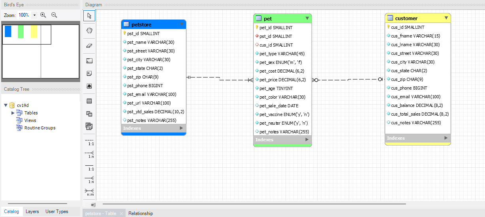
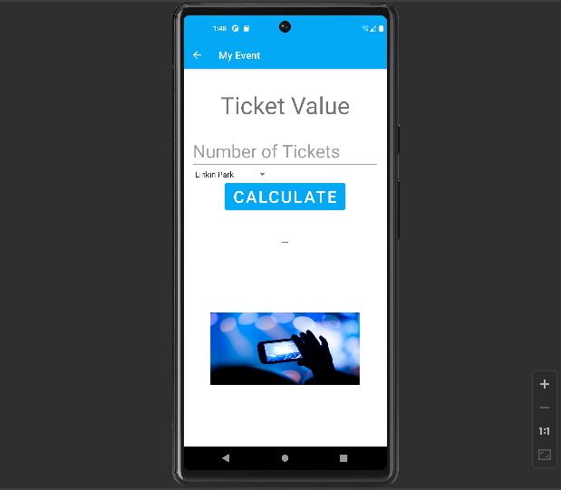
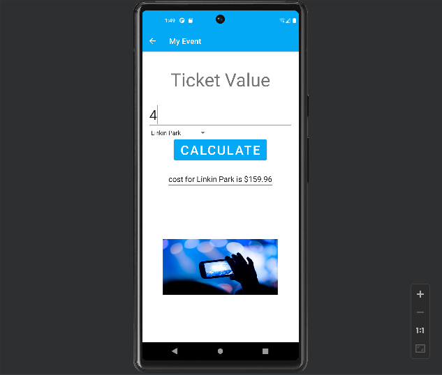
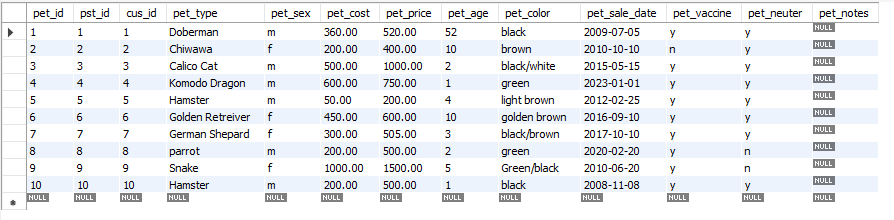
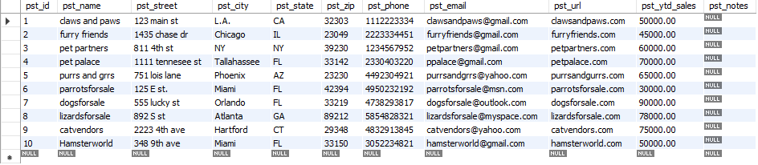
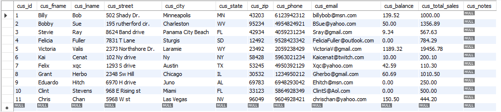
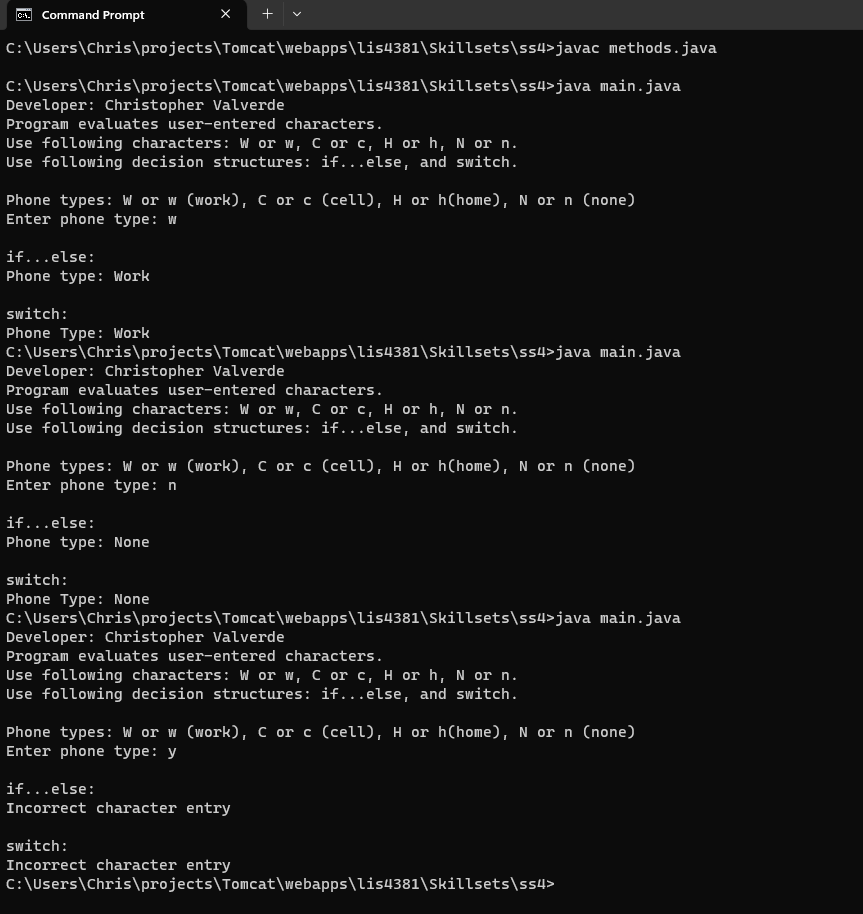
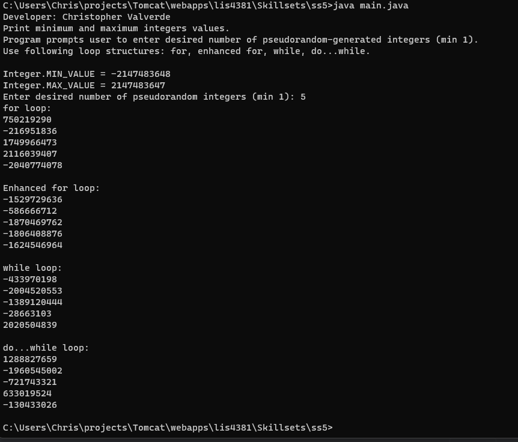
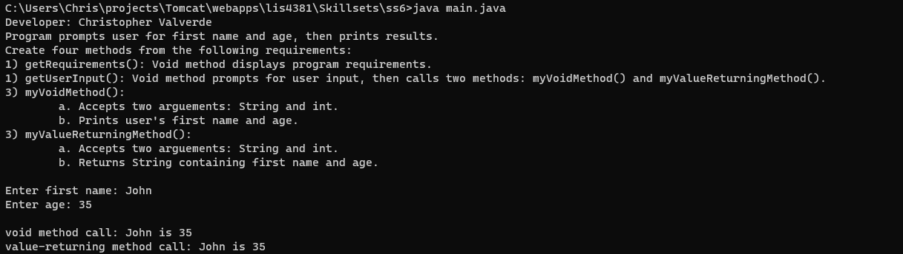

# LIS4381 - Mobile web application development

## Christopher Valverde

### Assignment 3 Requirements:
1. Assignment requirements, as per A1. 
2. Screenshot of my event app
3. Create ERD 
4. Upload A3 sql and mwb file and create link in README.md; 

#### README.md file should include the following items:

* screenshot of ERD
* Screenshot of running aplications opening interface
* Screenshot of running applications processing user input
* Screenshot of 10 records for each table
* Link to A3 files 
* [a3.mwb](img/a3.mwb "a3 mwb file")
* [a3.sql](img/a3.sql "a3 sql file")
* Skillsets

#### Assignment Screenshots:

*Screenshot of ERD*:

*Screenshot of opening user interface*:

*Screenshot of processing user input*:

*Screenshot of records in each table*:

*Screenshots of skillsets*:

