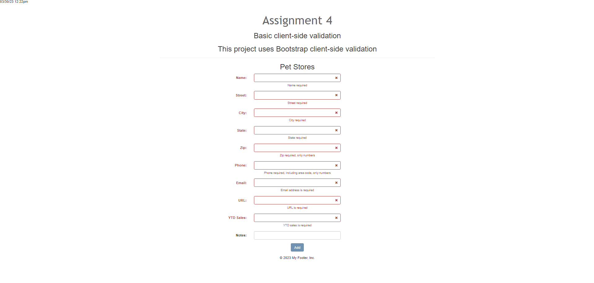

# LIS4381 - Mobile web app development

## Christopher Valverde

### Assignment 4 Requirements:
1. Course title, your name, assignment requirements, as per A1;
2. Screenshots as per below examples;
3. skillsets

#### README.md file should include the following items:

* A1, A2, A3, and P1 links must work, and each index.php file should have content, as per the associated Bitbucket README.md files.
* [Link to local lis4381 web app](http://localhost/repos/lis4381/index.php)
* screenshots of home page
* screen shot of client side validation
* Skillsets

#### Assignment Screenshots:

*Screenshot of homepage*:

*Screenshot of failed validation*:

*Screenshot of successful validation*:

*Screenshot of skillset 10*:

*Screenshot of skillset 11*:

*Screenshot of skillset 12*:

