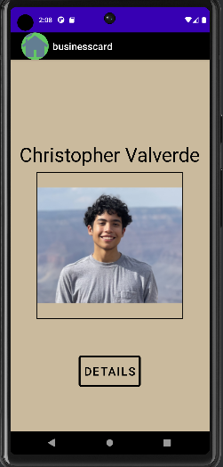
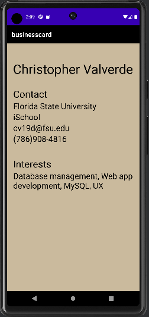
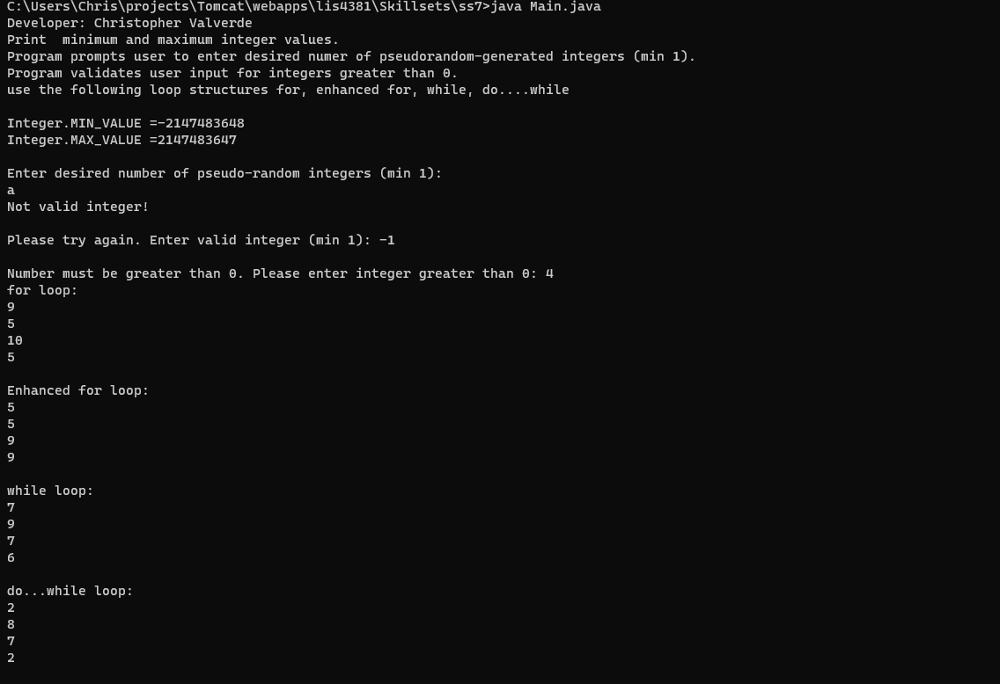
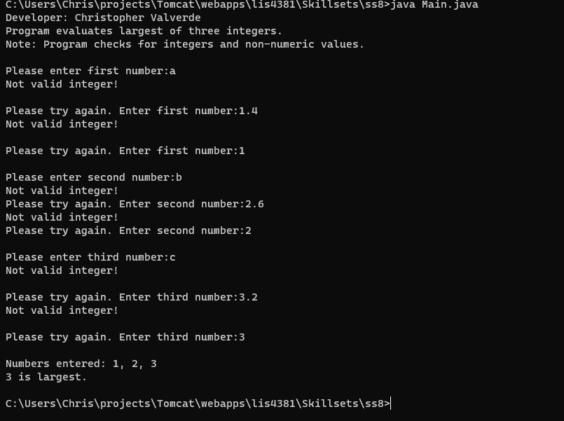

# LIS4381 - Mobile web apps development

## Christopher Valverde

### Project 1 Requirements:

1. Backward engineer screenshots 
2. Must add background color(s) to both activities
3. Must add border around image and button
4. Must add text shadows (button)

#### README.md file should include the following items:

* Course title, your name, assignment requirements, as per A1;
* Screenshot of running application’s first user interface;
* creenshot of running application’s second user interface 
* Skillsets

#### Assignment Screenshots:

*Screenshot of first interface*:

*Screenshot of second interface*:

*Screenshot of skillset 7*:

*Screenshot of skillset 8*:

