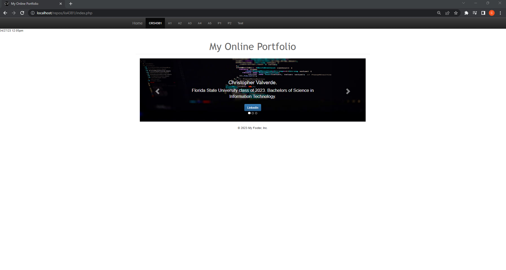
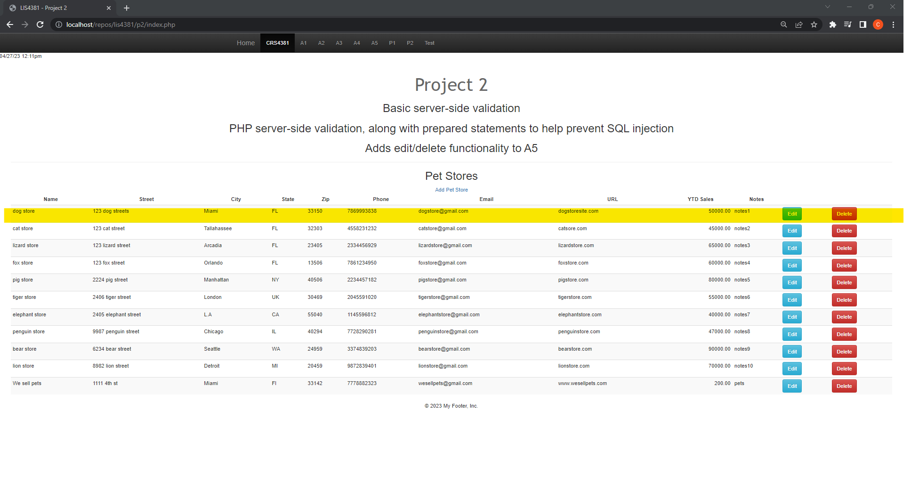
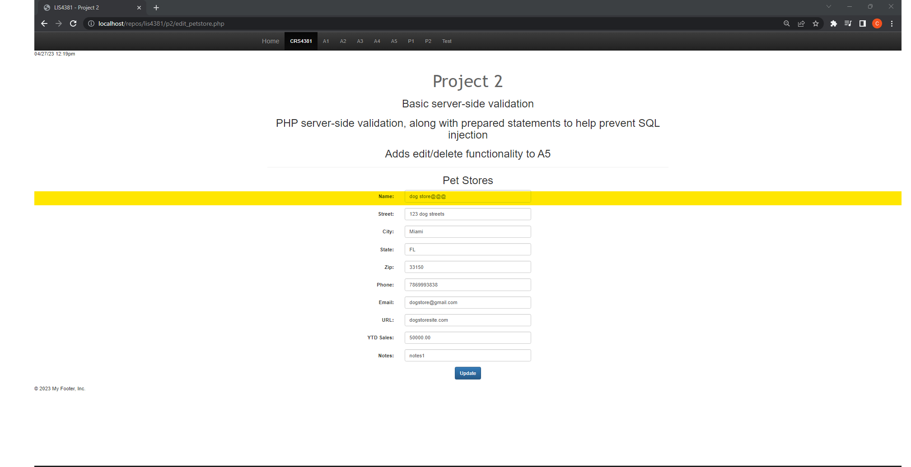
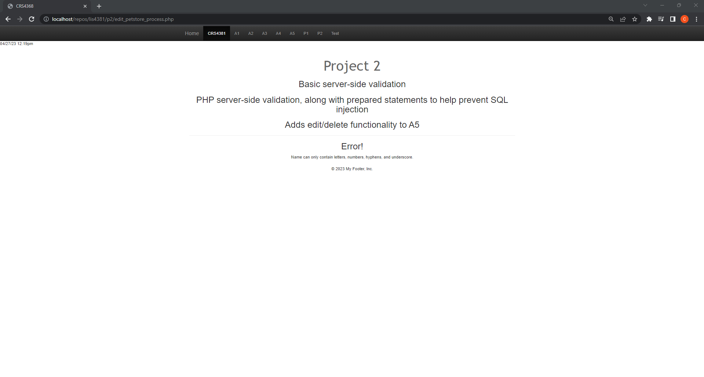
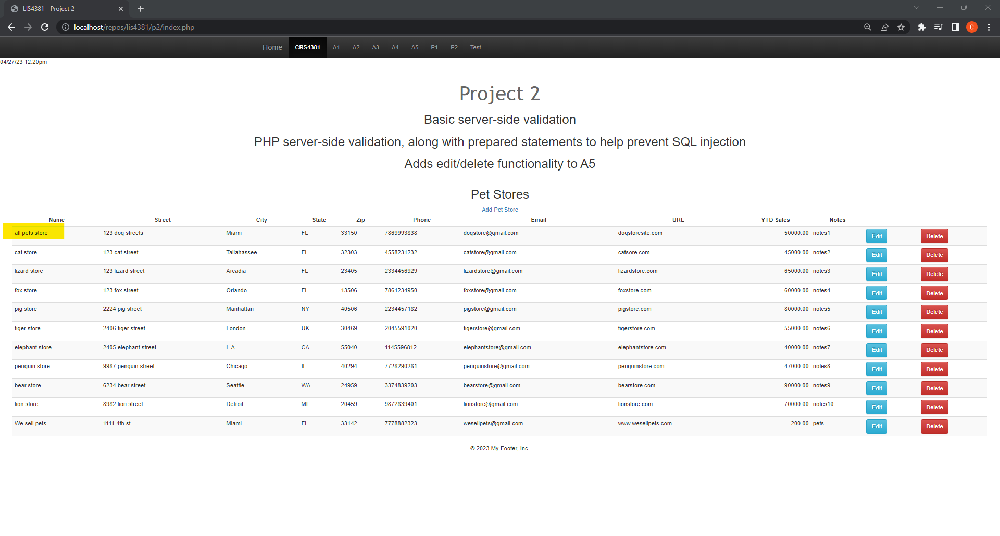
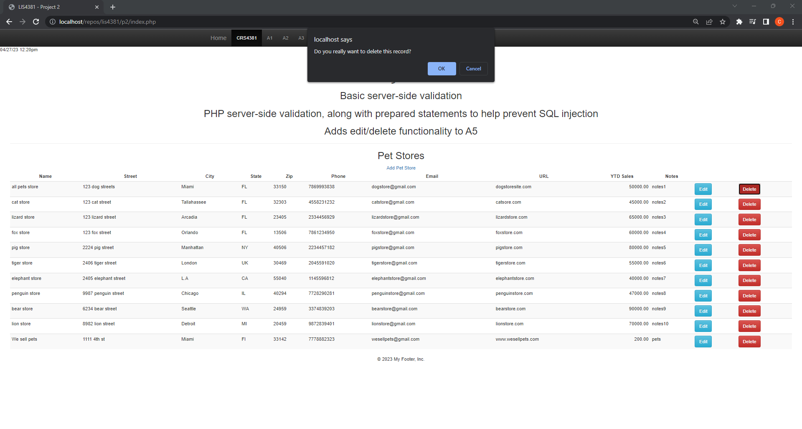
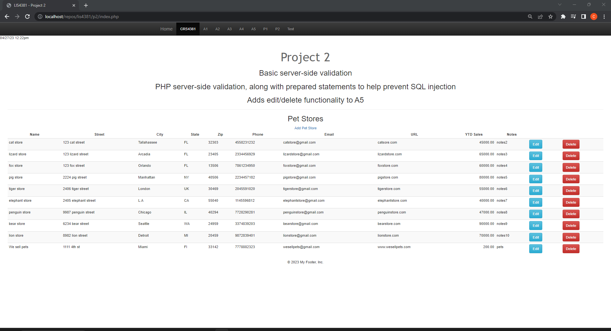
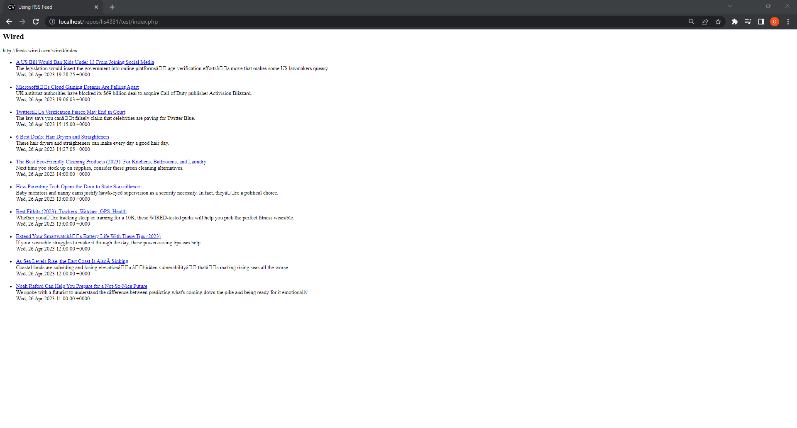

# LIS4381 - mobile webapp development

## Christopher Valverde

### Project 2 Requirements:
1. Course title, your name, assignment requirements, as per A1;
2. Screenshots as per below examples;
3.  Link to local lis4381 web app

#### README.md file should include the following items:

* [Link to local lis4381 web app](http://localhost/repos/lis4381/index.php)
* screenshots of home page
* screen shot of server-side validation

#### Assignment Screenshots:

*Screenshot of homepage*:

*Screenshot of p2 index*:

*Screenshot of edit in petstore*:

*Screenshot of failed validation*:

*Screenshot of passed validation*:

*Screenshot of delete prompt*:

*Screenshot of deleted record*:

*Screenshot of rss feed*:

