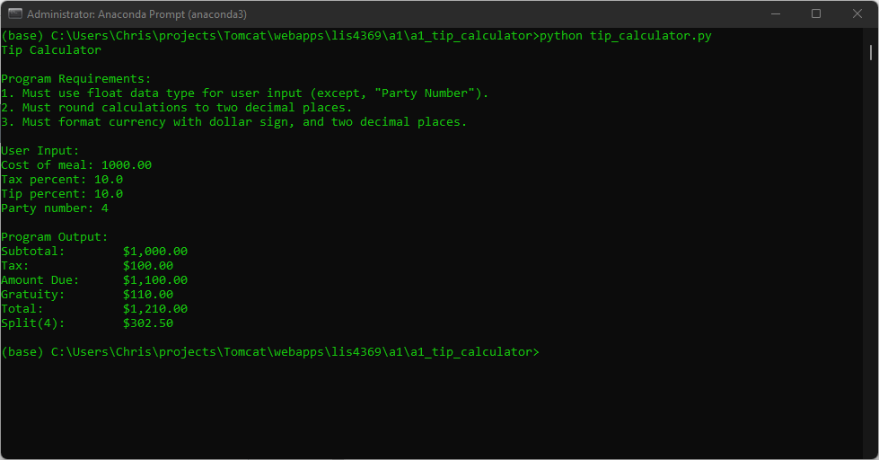

# LIS4930 - Exploration into AI, Machine and Deep Learning

## Christopher Valverde

### Assignment 1 Requirements:

*four parts:*

1. Distributed Version Control with Git Bitbucket
2. Development Installations
3. Questions
4. Bitbucket repo links:
    * this assignment
    * Bitbucket station location

#### README.md file should include the following items:

* screenshot of a1_tip_calculator running
* Link to A1 .ipynb file: [tip_calculator.ipynb](a1_tip_calculator/tip_calculator.ipynb "A1 Jupyter Notebook")
* git commands w/short descriptions

> #### Git commands w/short descriptions:

1. git init - Create an empty Git repository or reinitialize an existing one
2. git status - Show the working tree status
3. git add -  Add file contents to the index
4. git commit - Record changes to the repository
5. git push - Update remote refs along with associated objects
6. git pull -  Fetch from and integrate with another repository or a local branch
7. git log - show commit logs

#### Assignment Screenshots:

<table>
  <tr>
    <td>Screenshot of a1_tip_calculator application running(IDLE)</td>
     <td>Screenshot of a1_tip_calculator application running (Visual Studio Code)</td>
  </tr>
  <tr>
    <td style=></td>
    <td></td>
  </tr>
 </table>

*A1 Jupyter Notebook*:

#### Tutorial Links:

*Bitbucket Tutorial - Station Locations:*
[A1 Bitbucket Station Locations Tutorial Link](https://bitbucket.org/cv19d/bitbucketstationlocations/src/master/ "Bitbucket Station Locations")
